## CVE-1999-0182漏洞分析

### 漏洞介绍

在Samba 1.9.19与之前版本中未对用户输入的密码长度进行检查，可造成缓冲区溢出漏洞。

### 漏洞分析

运行exp程序，采用tcpdump抓包，还原触发漏洞的过程。

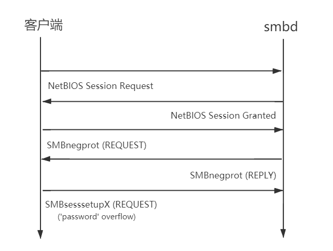

分析exp程序，从main函数的第49行开始，说明了AMDkillsamba程序的用法，其中netbios name对应着运行smbd主机的名称，在第一步的NetBIOS Session Request中需要用到。

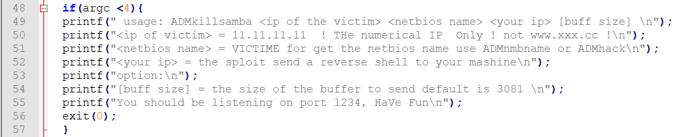

在exp的结尾，通过调用smbclient程序发起请求。其中bufferz参数格式为`\\\\SAMBA\\IPC$`，表示向smbd请求IPC服务。buff参数传入我们构造的payload，smbclient会将其作为用户提供的密码发送给smbd服务，从而造成栈溢出。-n为目标主机smbd服务的netbios name，-I为目标主机的IP。-s指定我们所调用smbclient时需要读取的配置文件，其中SMB通信使用的协议以及是否对密码进行加密。最后的-t参数设置smbclient的超时等待时间。

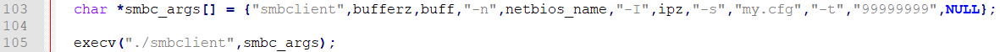

在wireshark中查看NetBIOS Session Request包，可以看到请求了名为SAMBA的Server service。

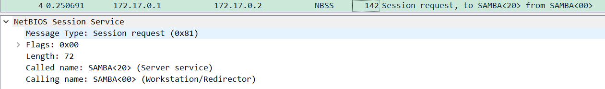

在接收到smbd回复的NetBIOS Session Granted之后，smbclient接着发送SMB Negotiate Protocol Request, 将我们所使用的参数告知smbd服务器，进行协议的协商。

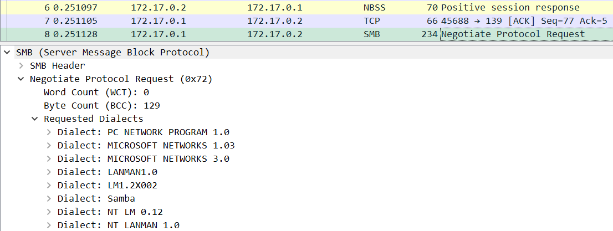

接着smbclient发送SMB Session Setup AndX Request，在此数据包中将会发送密码，密码的长度在`ANSI Password Length`中指定，密码包含在`ANSI Password`字段中。

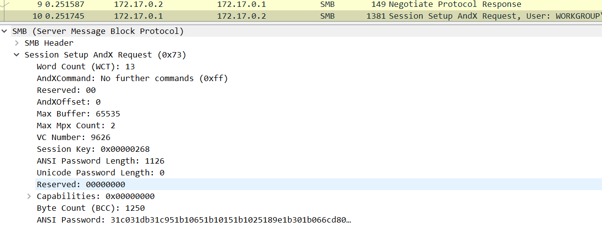

当触发缓冲区溢出漏洞并成功执行shellcode后，在Wireshark中可以看到被攻击的主机向我们所指定IP地址的1234端口发送连接请求并反弹shell。在编号为15的包中可以看到，从攻击主机发送了ls命令。

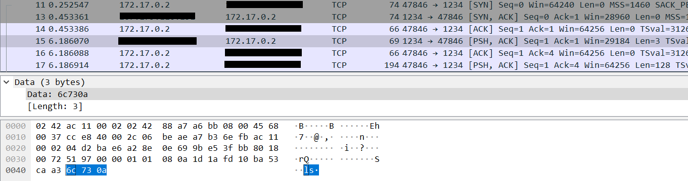

并在编号为17的包中收到了来自被攻击主机发送的回复，可以看到ls命令返回的结果。

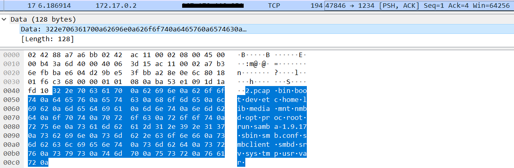

通过对比漏洞修复后版本的reply.c文件，可以找到在reply_sesssetup_and_X函数中加入了检测栈溢出攻击的代码片段。通过判断smb_apasslen也就是密码长度是否超过程序所设定的最大值MAX_PASS_LEN来防止长密码造成的栈溢出。

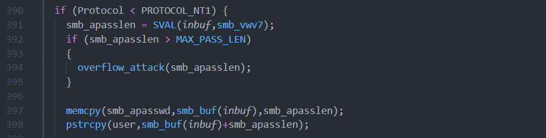

定位存在的漏洞函数后，使用gdb调试smbd，将断点下在reply_sesssetup_and_X。通过bt命令可以看到调用栈。smbd先从server.c的main函数开始，当接收到来自客户的SMB请求后调用construct_reply函数来构造返回信息的内容。由于请求为SMBsesssetupX通过switch_message最终调用函数reply_sesssetup_and_X。

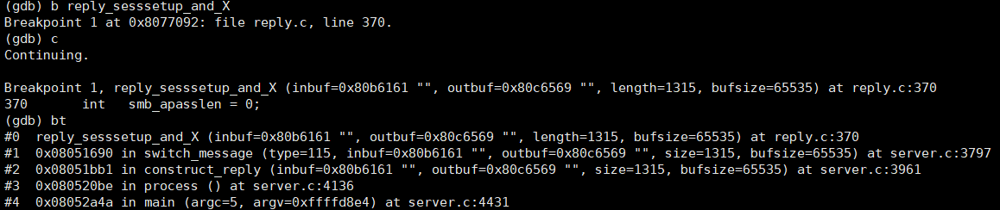

第399行所定义的passlen1对应前面提到的`ANSI Password Length`，在第455行赋值给smb_apasslen。并在第456行通过`StrnCpy (smb_apasswd,p,smb_apasslen)`将从客户端接收到的密码复制到了smb_apasswd中。

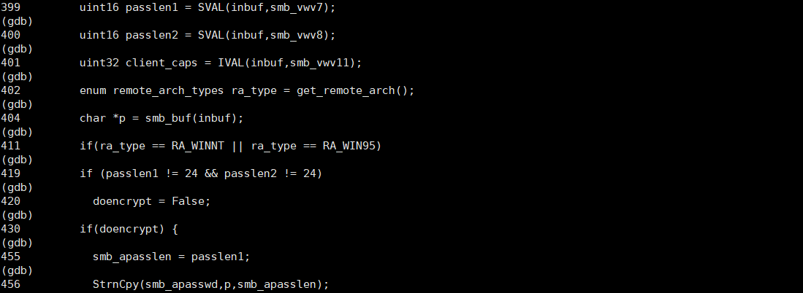

查看smb_apasswd地址以及内容，可以看到已经存入我们的shellcode。

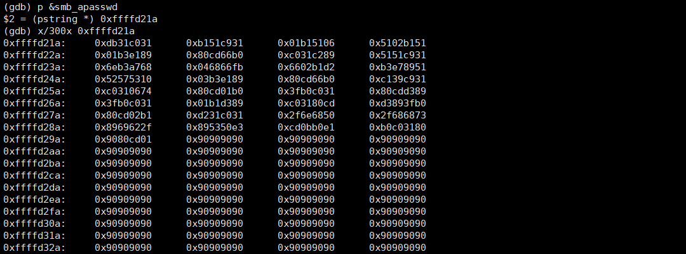

查看ebp，可以看到已经被覆盖为我们指定的返回地址0xffffd21a，也就是smb_apasswd的地址。

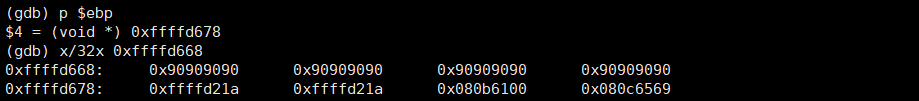

为了演示方便，在456行的StrnCpy函数后加上一行return 1，令程序直接返回从而跳转并执行我们的shellcode。在实际的程序中由于后续代码会访问我们已经覆盖的地址内容，原因是当地址内容不是合法可以访问的内存时程序会产生段错误。

最终shellcode执行成功，被攻击主机返回反弹shell并连接到我们指定的IP地址。

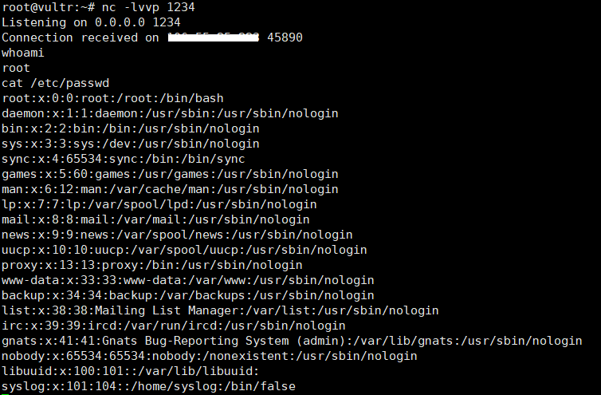

