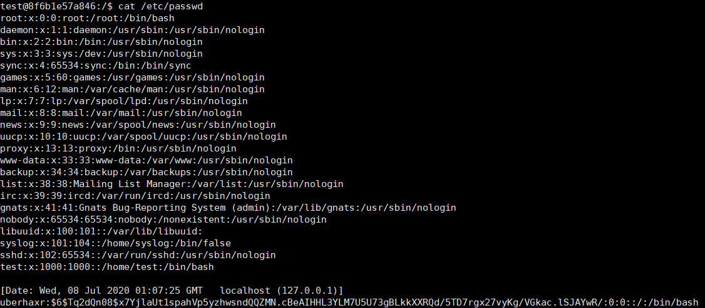

## CVE-2000-0935漏洞分析

### 漏洞介绍

SWAT是一款基于网页的Samba管理程序，默认监听在901端口。由于在Samba 2.0.7版本中的SWAT将日志记录在/tmp/cgi.log路径下，非root用户可通过将该日志文件指向/etc/passwd，从而添加任意权限用户以达到提升权限的目的。

### 漏洞分析

通过全局搜索cgi.log关键字，可以将漏洞定位到源码`web/cgi.c`的`cgi_setup`函数中。


由于日志记录不是默认开启，因此需要将`web/cgi.c`第29行的CGI_LOGGING字段修改为1。


修改之后编译安装Samba，由于SWAT需要由xinetd运行，因此需要将SWAT的配置文件置入/etc/xinetd.d文件夹下，其内容如下，主要配置监听端口，swat程序路径，程序参数等：

```
service swat
{
    port            = 901
	socket_type     = stream
	wait            = no
	user            = root 
	server          = /samba-2.0.7/source/bin/swat 
    server_args     = -d 10
	log_on_failure += USERID
	disable         = no
}
```

通过命令`/etc/init.d/xinetd start`开启xinetd服务，curl本地901端口提示"Authorization Required"则可以确认SWAT程序正确运行在901端口。


接着分析exp程序，首先判断/tmp/cgi.log程序是否存在，若已经存在则尝试删除。接着为/etc/passwd创建软链接/tmp/cgi.log，使将来SWAT记录的日志内容会自动添加到/etc/passwd之后。


若上述步骤成功执行，exp将尝试连接本地901端口，访问SWAT服务。


若SWAT服务正常运行，当用户按下空格之后，exp将发送一串字符，其完整内容为`uberhaxr:$6$Tq2dQn08$x7YjlaUt1spahVp5yzhwsndQQZMN.cBeAIHHL3YLM7U5U73gBLkkXXRQd/5TD7rgx27vyKg/VGkac.lSJAYwR/:0:0::/:/bin/bash\n`。当SWAT服务接收到这段字符之后将会把内容追加在/tmp/cgi.log中。由于我们之前创建的软链接，实际效果相当于在/etc/passwd中添加了我们指定的字符串。


/etc/passwd是Linux系统中用于存放用户以及权限记录的文件，其格式如下：

```
username:password:User ID:Group ID:comment:home directory:shell
```

在我们的payload中，`uberhaxr`代表用户名。

`$6$Tq2dQn08$x7YjlaUt1spahVp5yzhwsndQQZMN.cBeAIHHL3YLM7U5U73gBLkkXXRQd/5TD7rgx27vyKg/VGkac.lSJAYwR/`代表密码，其格式为：`$id$salt$encrypted`，id为6表示加密方式为SHA-512。salt用于增加破解难度，本例中密码的明文值为test。

我们指定的User ID以及Group ID都为0，为root用户的权限。comment也就是注释，内容为空。家目录指定为根目录，shell指定为`/bin/bash`。

若payload被成功发送并写入到cgi.log，那么此时/etc/passwd已经追加了我们所创建的用户。在最后一步，exp尝试切换到我们所创建的用户`uberhaxr`，切换成功后可以获取本机系统的root权限。

接着尝试对swat程序进行调试，运行exp并暂时不按下回车键，此时停留在已经连接到SWAT但还未发送payload的阶段：


找到SWAT程序的PID，使用gdb挂载调试。使用bt命令可以查看程序的调用栈：


可以看到程序首先从`web/swat.c`的main函数进入，并调用了`web/cgi.c`的cgi_setup。从`web/swat.c`的源码中可以看到，在main函数的第1002行调用了cgi_setup。


进入cgi_setup函数中查看，首先在第478行判断是否设置了CGI_LOGGING，并通过`FILE *f`初始化日志文件。


接着在第503行，程序尝试通过`sys_fopen("/tmp/cgi.log", "a")`打开/tmp/cgi.log文件。首先向日志中写入访问时间，访问用户，IP地址等信息。接着在第512行调用了fgets函数读取来自web客户端请求的输入内容，并将其记录在/tmp/cgi.log文件中。


在gdb中将断点下在fgets函数，并回到exp程序按下回车键发送payload。


返回gdb调试，单步执行，跟进到iogetline.c中，打印变量c的值可知字母u的ASCII码对应的是117，同我们的payload`uberhaxr:$6$Tq2dQn08$x7YjlaUt1spahVp5yzhwsndQQZMN.cBeAIHHL3YLM7U5U73gBLkkXXRQd/5TD7rgx27vyKg/VGkac.lSJAYwR/:0:0::/:/bin/bash\n`的第一个字符相同。


通过将字符写入文件，最终将写入的结果通过result变量返回。


按下回车结束exp，此时读取/etc/passwd文件可以看到payload内容已经成功写入：

