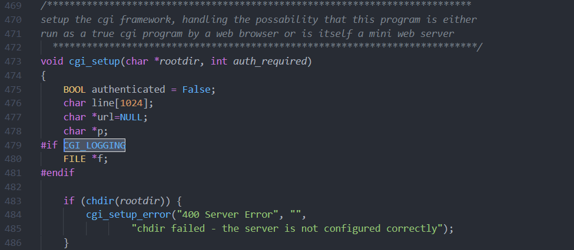
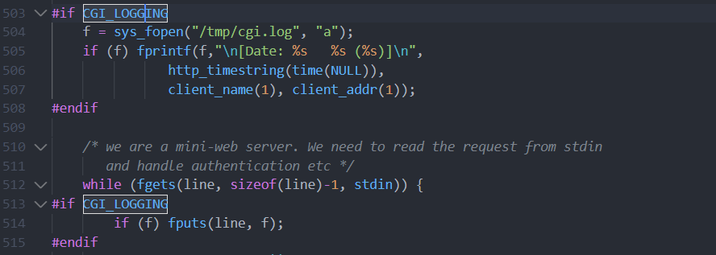
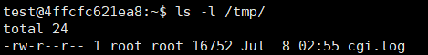
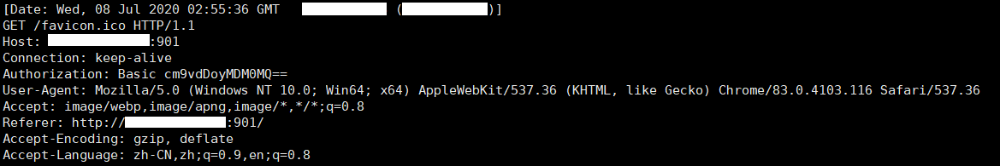
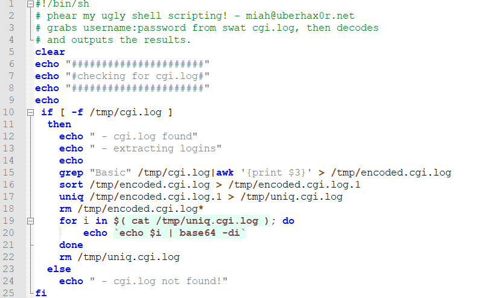
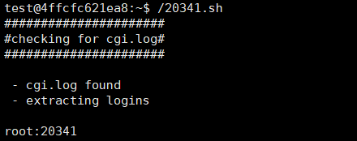

## CVE-2000-0936漏洞分析

### 漏洞介绍

在Samba 2.0.7中的SWAT程序会将日志文件cgi.log设置为所有用户可读权限，导致本地低权限用户可以读取日志文件中记录的历史用户登录密码。

### 漏洞分析

漏洞存在于Samba 2.0.7版本源码`web/cgi.c`的cgi_setup函数中，通过将CGI_LOGGING参数设置为1，开启SWAT的日志记录功能。



从cgi_setup函数的第503行开始，将打开或创建/tmp/目录下的cgi.log文件，并调用库函数fgets将来自stdin的输入存入line中，并写入cgi.log文件中。



fgets的声明如下，其中str是指向一个字符数组的指针，该数组存储了要读取的字符串。n是要读取的最大字符数。stream是指向 FILE 对象的指针，该 FILE 对象标识了要从中读取字符的流。

```
char *fgets(char *str, int n, FILE *stream)
```

通过`ls -l /tmp`可以查看cgi.log的权限：



文件的权限为`-rw-r--r--`，其解析如下：

+ 第一个字符为`-`，代表这是一个文件。
+ 第一组`rw-`表示文件所有者权限为读写。
+ 第二组`r--`表示与文件所有者同一组的用户的权限是读，但不可写不可执行。
+ 第三组`r--`表示除上述用户以为的其它用户的权限是读。

接下来3个字段分别代表如下内容：

+ 1 表示连接的文件数。
+ root 表示用户。
+ root表示用户所在的组。

因此可知，系统中所有用户都能够读取cgi.log文件中的内容。

cgi.log中记录的内容格式如下：



由于当用户登录SWAT时是通过HTTP Auth进行身份验证，用户名和密码以`用户名:密码`的格式经过Base64编码之后放入Authorization请求头，格式为`Basic Base64编码内容`，并且在接下来的HTTP请求过程中都会带有字段。

接着分析exp程序：



可以看到exp程序提取出了/tmp/cgi.log中包含"Basic"文本行空格分隔的第三部分，并将其存入/tmp/encoded.cgi.log中。接着使用sort和uniq命令对/tmp/encoded.cgi.log中的内容进行排序和去重操作，并存入/tmp/uniq.cgi.log文件中。接着从第19行的for循环开始，将提取出的Base64字符串进行解码，最终得到明文形式的用户名和密码。



造成此漏洞的原因有两个，首先是入上文所说的SWAT应用在储存日志文件时没有考虑到对日志文件的访问权限进行限制。并且未能够考虑到用户登录密码可能通过日志文件泄露。

第二个原因在于HTTP Auth验证方式本身的不安全性，由于其将用户名和密码仅仅通过Base64进行编码，当通过HTTP发送请求时容易受到中间人攻击。并且当HTTP请求被记录在文件中时也可能造成隐私泄露。