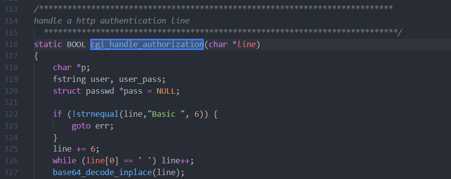

## CVE-2004-0600漏洞分析

### 漏洞介绍

SWAT是Samba Web管理工具。由于SWAT在对HTTP基本认证请求头进行base64解码的时候存在缓冲区溢出问题，远程攻击者可以利用这个漏洞在系统上以SWAT进程权限执行任意指令。 

### 漏洞分析

SWAT需要在HTTP请求头中提供Authorization字段，将web客户端提供的用户名密码进行base64编码后发送给服务器再由服务器解码从而对访问用户进行认证，其过程如下：

下面实际演示一遍过程，首先通过浏览器访问目标服务器的901端口，提示需要提供用户名密码

使用burpsuite抓包验证，可以看到在HTTP头的Authorization字段中包含`"Basic ****"`字段，当用户名密码不正确时服务器会返回HTTP/1.0 401 Bad Authorization，否则返回HTTP/1.0 200 OK。

其中base64编码字段解码后格式为"用户名:密码"

当将base64编码字段改为"="时，服务器没有返回任何结果，实际上触发了缓冲区溢出

源码分析：

首先随着SWAT开始运行，在`web/swat.c`的main函数中第1342行调用了`cgi_setup`函数，其在`web/cgi.c`的第471行中定义。可以看到在`cgi_setup`的第509行调用`fgets`来读取来自客户端的HTTP请求，并处理HTTP请求头。在第532行，调用`cgi_handle_authorization`来处理Authorization请求头的内容。

跟进查看，可以看到函数首先判断内容是否以"Basic "开头，接着从不是空格开始，将剩下的内容传入`base64_decode_inplace`函数中。

`base64_decode_inplace`函数在`lib/util_str.c`中定义：

需要进行base64解码的字符串被继续传入到`base64_decode_data_blob`函数中：

函数中n定义类型为int，代表最终解码得到字符串长度。如果字符"="是最后一个数据，就会从n值中减一。漏洞存在于第1954行，当接收到的数据只为"="时，n为0-1，从而产生负整数溢出。并且由于这个整数值会在之后进行memcpy()操作，因此可以造成越界内存拷贝。

使用gdb调试，可以看到此时n对应的decoded.length值变为4294967295，也就是0xFFFFFFFF。

