## CVE-2009-1886漏洞分析

### 漏洞介绍

smbclient应用程序中存在格式化字符串漏洞，程序在处理文件夹名称的过程中可将用户输入看作asprintf函数的格式化字符串参数。攻击者可通过诱骗受害者发送"put"命令上传恶意构造的文件名称，从而导致smbclient执行任意代码或程序崩溃。

### 漏洞分析

格式化字符串漏洞的产生原因在于printf, vsprintf等函数是可变参数的函数，函数的调用者可以自由的指定函数参数的数量和类型，被调用者无法知道在函数调用之前到底有多少参数被压入栈帧当中。所以printf函数要求传入一个format参数用以指定到底有多少，怎么样的参数被传入其中。但由于编程者的疏忽，未能够指定格式化字符串而是把格式化字符串的操纵权交给用户，就会产生任意地址读写的漏洞。常见的格式化字符串如下：

```
%d - 十进制 - 输出十进制整数
%s - 字符串 - 从内存中读取字符串
%x - 十六进制 - 输出十六进制数
%c - 字符 - 输出字符
%p - 指针 - 指针地址
%n - 到目前为止所写的字符数
```

通过Samba官方发布的[补丁](https://download.samba.org/pub/samba/patches/security/samba-3.2.12-CVE-2009-1886.patch)可知，漏洞原因出在调用talloc_asprintf_append函数时，程序未能指定格式化字符串，当用户提供了包含格式化字符串的输入时，程序会根据用户提供的格式化字符串读取并输出栈上的内容。

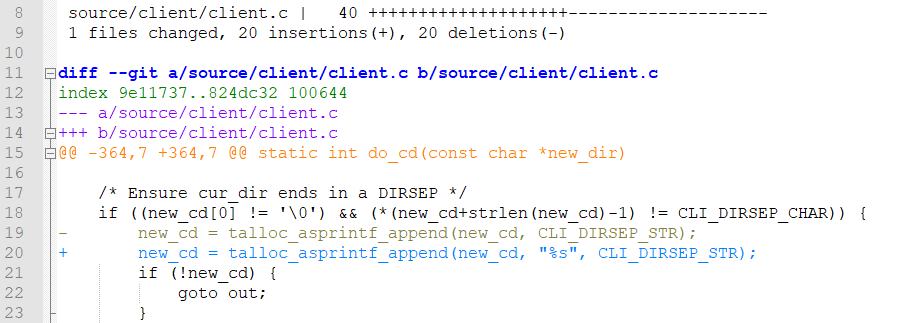

本次实验通过smbclient的文件上传功能来触发漏洞，负责上传文件的具体函数为client.c中的cmd_put。

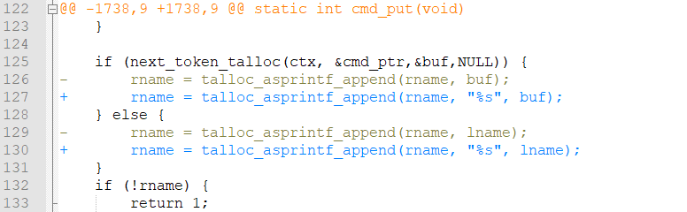

首先在靶机上运行smbclient，使用gdb附加在smbclient进程上，并将断点下在cmd_put函数。


在smbclient命令行中输入构造的格式化字符串文件名称，并按下回车。


返回gdb调试窗口，按下c令程序继续执行到断点。

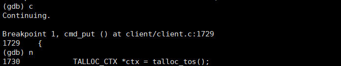

运行到漏洞存在处，可以看到我们输入的文件名称`aa%3Fbb`存储在lname变量中，rname的初始值为`//`。当调用了存在漏洞的talloc_asprintf_append函数后，lname应当被附加在rname之后，然而此时打印rname的值可以看到其值变为了`\\aa0.000000bb`。原因在于`%3F`被程序解析为了格式化字符串，输出保留小数点后6位的实数。

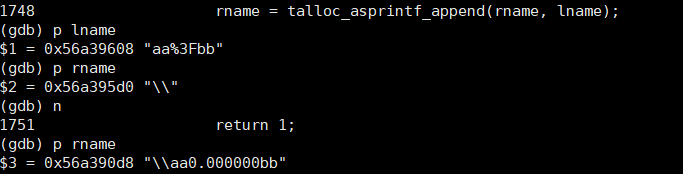

可以跟进查看talloc_asprintf_append函数。

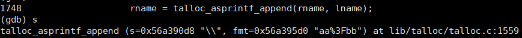

其调用了__talloc_vaslenprintf_append函数，可知最终调用了vsnprintf函数。

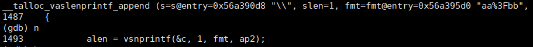

其定义如下：`int vsnprintf (char * s, size_t n, const char * format, va_list arg );`因此&c代表存储输出格式化字符串的buffer，1为指定格式化字符串的大小，fmt代表指定需要格式化字符串的format，ap2则是可变参数。

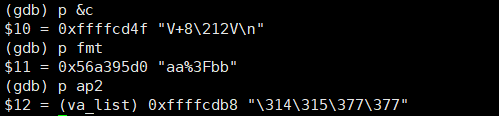

bt查看函数调用栈如下：

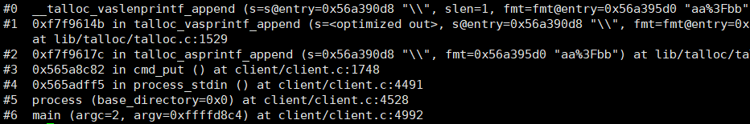

__talloc_vaslenprintf_append函数的汇编代码如下。

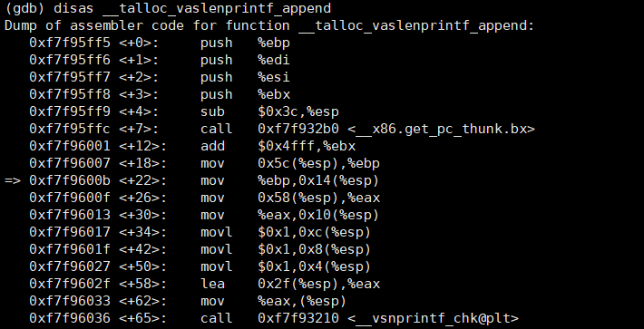

根据补丁修改cmd_put函数中的格式化字符串漏洞。

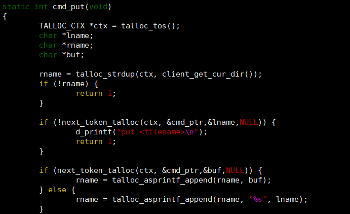

重新编译并运行调试smbclient.

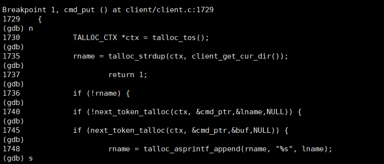

跟进查看，可知此时fmt已经改为"%s"。

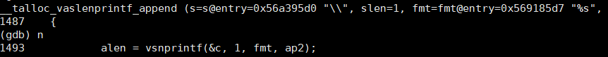

函数运行得到的结果也与用户输入`\aa%3Fbb`一致。

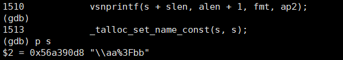

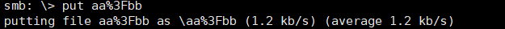

