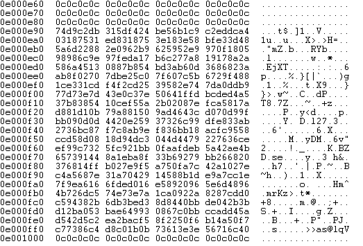

## CVE-2011-3400漏洞分析

### 漏洞介绍

OLE是应用程序用来创建和编辑复合文档的技术。该技术可在一种格式的文档 (例如Microsoft Word文档) 中嵌入或链接另一种格式的文档 (例如Microsoft Excel) 。由于ole32.dll在将OLE对象中包含的字符串属性转换为不定类型时存在类型混淆漏洞，因此导致该字符串的前4个字节被视为VTABLE指针，这可能导致执行任意代码。

### 漏洞分析

通过Wireshark抓取攻击者主机与受害者主机之间的HTTP数据流量包，可以看到受害者向攻击者的IP (涂黑部分) 请求了两个资源，第一个是HTML页面，第二个是`.vsd`文件。使用Wireshark的导出功能，可以获得这两个资源的内容。

首先打开导出的TtXJhovrYSqx文件，可以看到``标签中包含一段JavaScript代码，其作用是通过heaplib.js 库进行堆喷射，将包含shellcode的代码分布到IE浏览器的内存中。

另外注意到在下方的`<object></object>`标签内引用了`KZLopBTh.vsd`文件。在开启了ActiveX功能Windows的IE浏览器中，允许在网页中通过`<object>`标签来引用并渲染COM对象。其中classid就是ActiveX控件的ID，在Windows的注册表中可以查到上图页面所引用的id对应着Microsoft Visio Document数据。

因此这个HTML页面的作用有两点：1. 通过JavaScript进行堆喷射，布局shellcode；2. 引用`.vsd`文件，触发用户浏览器对该文件进行解析从而触发漏洞；

根据漏洞发现者的[文章](http://aluigi.altervista.org/adv/ole32_1-adv.txt)可知漏洞触发点在ole32.dll的CoWaitForMultipleHandles函数中，在0x7756edd5地址处的`call dword ptr [ecx+8]`可造成命令执行。

由于文章中的系统可能与本实验搭建的靶机系统版本有出入，因此需要用IDA打开本实验靶机虚拟机上的ole32.dll，找到CPropertyStorage::ReadMultiple函数处的相应代码段，可以获得漏洞触发代码相应的地址，为0x7756EF66。

让我们使用WinDbg附加到IEXPLORE.EXE进程中进行调试，并在0x7756EF66处下断点：

在IE浏览器中输入相应网址，访问攻击者主机提供的HTML页面，程序将运行至断点，可知单步运行后程序将跳转到[ecx+8]地址处：

查看ecx寄存器地址处的值，可知[ecx+8]中存放的地址为0x0e000000。

查看地址0x0e000000处的值：

继续查看下面的地址内容，可以看到在`0x0c0c0c0c`的片段中夹着一段代码并一直重复，推断为堆喷射造成的结果。程序跳转到由JavaScript提前布局好的Shellcode处，并执行完成漏洞利用。

可以从exp脚本中看到HTML页面是如何生成的，在``标签中的JavaScript代码存放在变量js_pivot。

而js_pivot中code的部分对应着js_code，而js_code则是由payload进行编码得来，payload就是metasploit生成的shellcode，将负责在漏洞利用成功后跳转执行，获取漏洞靶机的反弹shell。

了解了漏洞利用代码的生成过程后，我们将详细讲解漏洞形成的原因以及利用方式。

在上面提到HTML页面通过`<object>`标签嵌入了`.vsd`格式的文件，IE在使用ActiveX加载该文件时将进行预览，此时就会需要ole32.dll对其中嵌入的OLE对象属性进行解析。在构造漏洞利用的`.vsd`文档时利用到了[HPSF](https://poi.apache.org/components/hpsf/internals.html)属性集。其构造如下：

HPSF由Header (头部) 和Section List (段表) 和Sections (段) 构成，其中Header以固定的0xfffe作为开头，Section List中包含了section format ID以及offset，而在Section中包含不同的属性种类 (Property Type) 以及offset。不同的属性拥有自己的属性ID和属性种类，这些属性描述了文档中的内容 (如标题，主题，作者等)。

漏洞具体的利用方式为，将HPSF中属性类型为VT_CF (0x11)，属性ID字符串为PID_THUMBNAIL的offset从0x1358改为0x13da。并且利用了VT属性VT_VERSIONED_STREAM (0x49)。

使用WinHex打开`KZLopBTh.vsd`文件可以验证。

之所以使用属性ID为0x49的VT_VERSIONED_STREAM，是因为在CPropertyStorage::ReadMultiple函数中，执行到漏洞存在部分之前存在一个条件判断，在0x7756EF57处将[edi]与0x49进行比较，若相等则跳转到存在漏洞的代码块。而此时[edi]中存放的就是属性ID的值。

在WinDbg中调试可以验证，此时edi中的值确实等于0x49。

