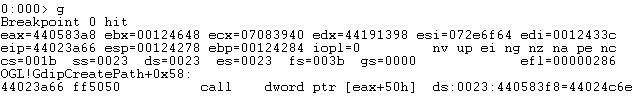

## CVE-2013-3906漏洞分析

### 漏洞介绍

通过在Microsoft Word的文档中面嵌入恶意构造的TIFF格式的图片，winword.exe在打开文档的时，会调用ogl.dll动态库解析TIFF图片，导致了整数溢出漏洞。

### 漏洞分析

为了确定漏洞利用的过程，我们将断点设置在OGL!GdipCreatePath的CALL DWORD PTR DS:[EAX+50]处，在IDA 中打开ogl.dll可以看到此段汇编代码的位置：

首先使用调试工具WinDbg附加在winword.exe进程中，再通过计算得到的偏移下断点：

下断点之后双击我们准备好的msf.docx文件，使用命令g继续运行可以看到程序成功在断点断下。

然而此时[eax+50h]指向的地址0x44024c6e为Microsoft Office的ogl.dll中的模块，并非我们控制的EAX所指向的地址，因此需要修改为如下条件断点: `bp OGL!GdipCreatePath+0x58 ".if (eax!=440583a8) {} .else {gc}"`。再次令程序运行到断点，可以看到此时[eax+50h]指向的地址为0x77c15ed5。

继续跟进查看，可以看到跳转到0x77c15ed5后执行的指令为`xchg eax,esp`，意为将eax和esp寄存器进行交换。

接着执行ret，返回到esp所指向的地址0x77c34fbf。继续执行`pop esp`命令并ret。

我们可以查看[eax+50h]地址0x200f0700处存放的内容，可以知道其中存放了一系列ROP汇编指令，并且每隔0x400就会重复一次，一共重复512次。因此可以猜测这是由我们msf.docx触发漏洞造成的堆喷射。它由Word文档中嵌入的activeX*.bin文件产生。

通过将msf.docx文件解压，进入`word/activeX`文件夹下可以看到里面有许多activeX*.bin文件。

打开查看，可以看到其中内容与WinDbg中dump出的0x200f0700处的内存一致。

继续使用调试器跟进，中间执行的ROP链就不详细描述，需要注意的一处在于运行到0x77c2acc的指令为`jmp dword ptr [eax]`，其中[eax]指向的是kernel32!VirtualProtect模块的地址。

步入查看，可知调用了kernel32!VirturalProteckEx程序。在先前的一系列push操作为传递的参数。

查看VirtualProtectEx的定义，可知hProcess对应0x0fffffff，lpAddress对应0x200f0764，dwSize为0x1，flNewProtect为0x40，lpflOldProtect为0x77c5d9bb。通过调用这个函数，可以令0x200f0764这段内存变成可执行，从而绕过了DEP。因此猜测上述地址中存放的内容为shellcode。

接着继续跟进ROP链，可以看到最后返回的时候esp的值正为0x200f0764，执行完ret后将会返回到这个地址并执行shellcode。

0x200F0768处的由一段经过XOR模糊化的shellcode开始，接着是Metasploit生成的payload。

该shellcode会开启一个rundll32.exe作为挂起进程，并将代码注入这个进程中，从而产生一个新的包含注入代码的线程。