## CVE-2014-1806漏洞分析

### 漏洞介绍

由于.NET Remoting服务没有对远端的身份进行有效性验证，允许远程客户端通过CodeDomProvider提供的CompileAssemblyFromSource方法编译、安装自定义.dll，从而造成任意命令执行。

### 漏洞分析

.NET远程处理是微软.NET Framework 中的一种网络通信技术，与 XML Web Service 不同的是，它可以使用SOAP 以外的协议来通信，而在服务端和客户端之间所操作的方法近乎相同，客户端可以不必考虑使用的协议，即可访问服务端所开放的对象。

.NET Remoting是一种进程间通信（IPC）的方式。服务端暴露一些可以远程调用的对象，客户端可以创建这些对象的实例，就如同创建本地对象一样，区别在于这些“本地的对象”运行在服务器端。通常情况下，这些可远程调用的对象放在一个共享的库中，客户端和服务端各自保存一份此DLL文件。.NET Remoting机制可以使用 TCP，HTTP 以及命名管道传输可远程调用的对象。

让我们首先分析exp漏洞利用模块中ExploitingRemotingService的代码，从Program.cs的main函数开始，首先创建通信channel，接着在判断.NET Remoting服务版本后，调用了CreateRemoteClass函数。

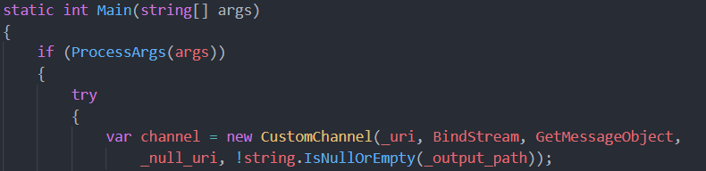

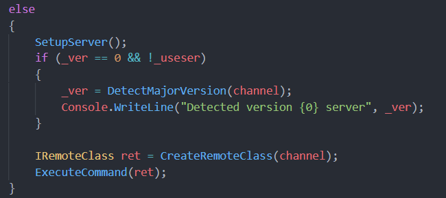

查看CreateRemoteClass函数定义，继续进入else语句中的CreateRemoteClassExploit查看。

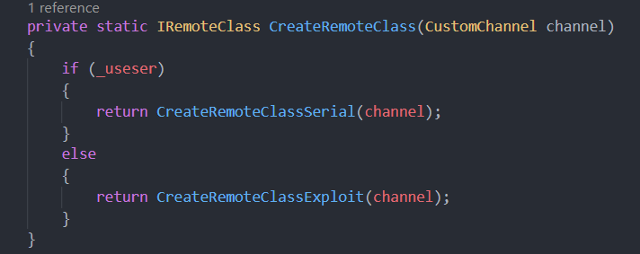

可以看到，在CreateRemoteClassExploit中通过MakeCall模板函数根据参数信息构建请求数据，发送到.NET Remoting服务端，并得到服务器执行结果。`MakeCall(_uri.AbsolutePath, GetStaticMethod(typeof(Path), "GetTempPath"))`的目的是调用远程服务器中Path对象的GetTempPath方法。接着通过MakeCall调用远程的函数完成了FakeAsm.dll的写入和安装

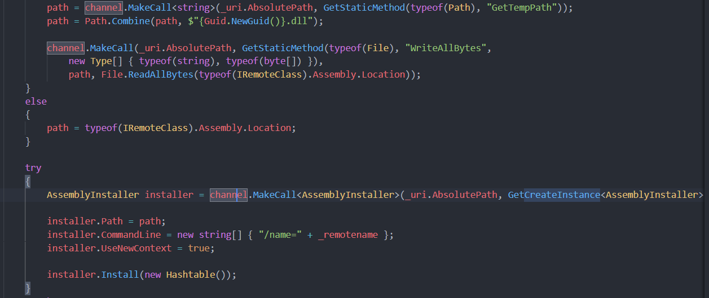

在通过Wireshark抓取到的数据包中可以看到FakeAsm.dll文件的上传过程。

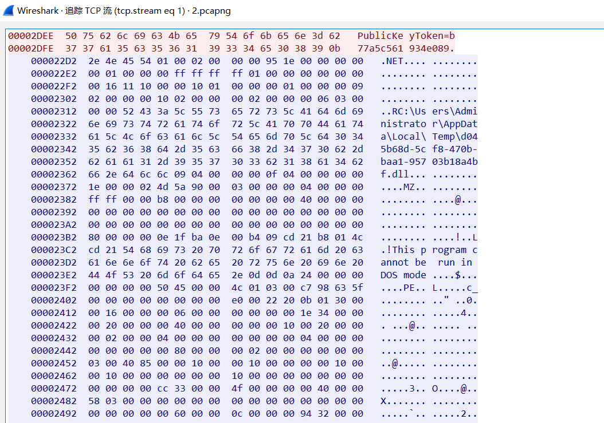

服务端的%TEMP%目录下也生成了相应的.dll。

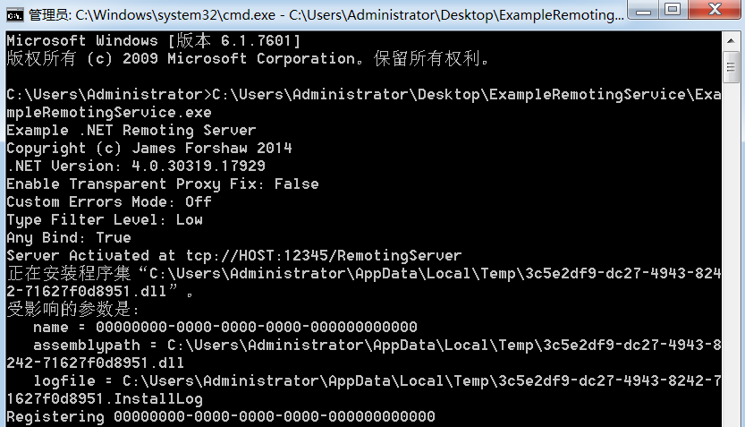

为了了解服务端的数据处理流程，使用调试工具WinDbg附加在.NET Remoting服务程序ExampleRemotingService.exe上进行调试。通过`bp kernel32!CreateProcessW`命令对CreateProcessW设置断点，并通过sos.dll扩展提供的命令`~*e!clrstack`来观察程序的托管代码调用堆栈。

可以看到，其中调用了FakeAsm.RemoteClass.RunProcess，在系统中运行程序执行命令。

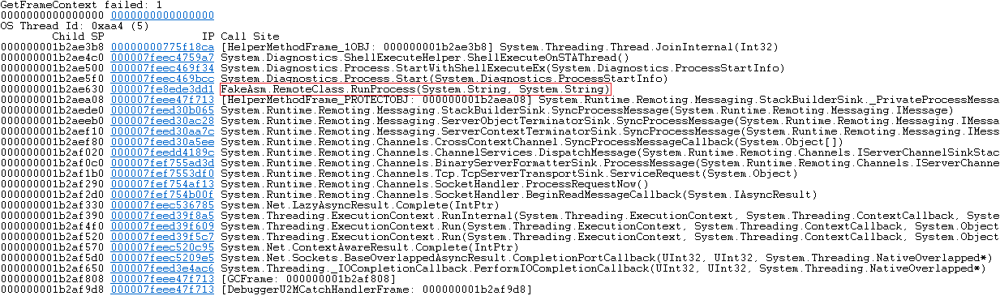

同时，使用.NET Reflector工具打开System.Runtime.Remoting.dll模块，对函数调用过程中使用到的方法进行分析。可以看到`System.Runtime.Remoting.Channels.Tcp.TcpServerTransportSink.ServiceRequest`方法通过`ITransportHeaders requestHeaders = handler.ReadHeaders()`和`Stream requestStream = handler.GetRequestStream()`获取了协议头和请求的对象流信息。

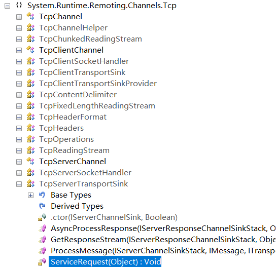

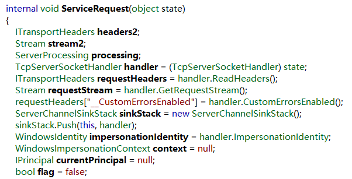

然后调用`System.Runtime.Remoting.Channels.BinaryServerFormatterSink.ProcessMessage`方法 ，该方法中通过`requestMsg = CoreChannel.DeserializeBinaryRequestMessage(uRI, requestStream, this._strictBinding, this.TypeFilterLevel)`对请求的对象流进行反序列化，成功之后则调用`System.Runtime.Remoting.Channels.DispatchChannelSink.ProcessMessage`。

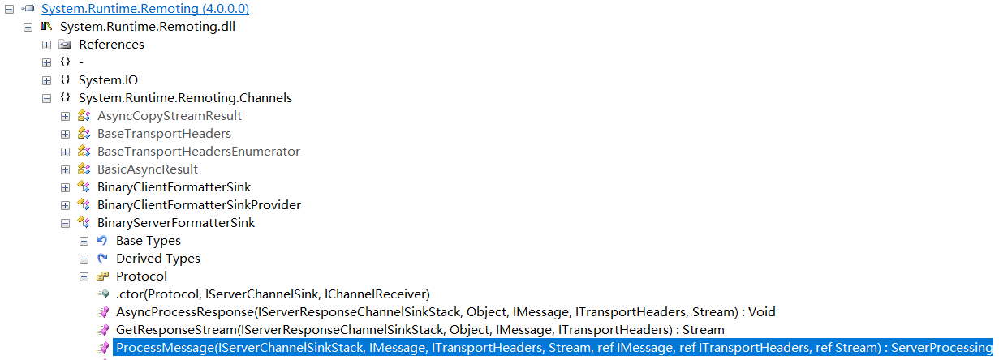

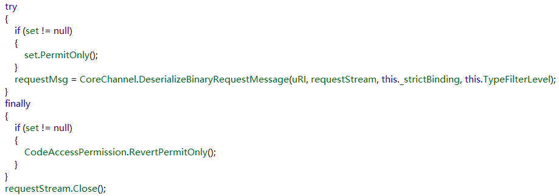

在`System.Runtime.Remoting.Channels.DispatchChannelSink.ProcessMessage`中简单判断之后，直接调用了`ChannelServices.DispatchMessage(sinkStack, requestMsg, out responseMsg)`分发消息。

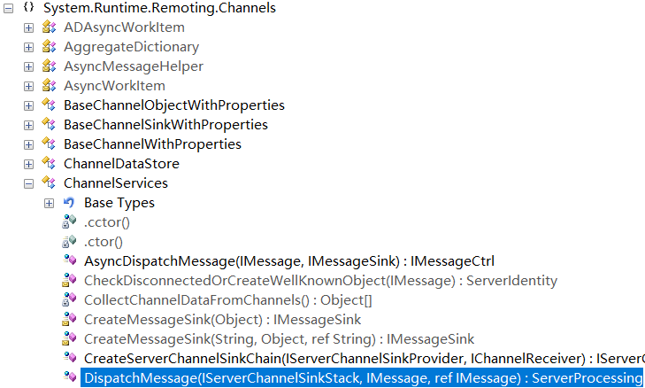

在`DispatchMessage`中则只是通过`IsMethodReallyPublic(methodBase)和RemotingServices.IsMethodAllowedRemotely(methodBase))`判断了远端调用的方法是否允许，如果满足条件，则进一步处理，最终调用该方法。

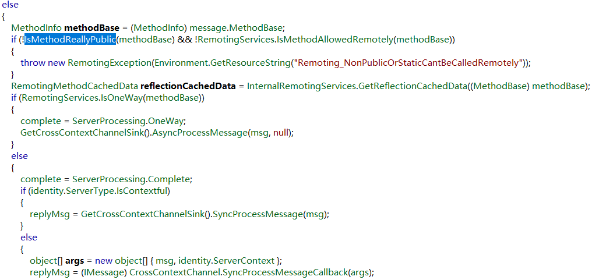

由于在整个过程中并没有对远端的身份进行有效性验证，因此导致可以通过.NET Remoting服务端提供的远程方法CreateInstance在服务端获取到CodeDomProvider对象，并通过CodeDomProvider提供的CompileAssemblyFromSource方法编译源码、安装FakeAsm.dll，最后创建IRemoteClass类对象来执行命令的漏洞。

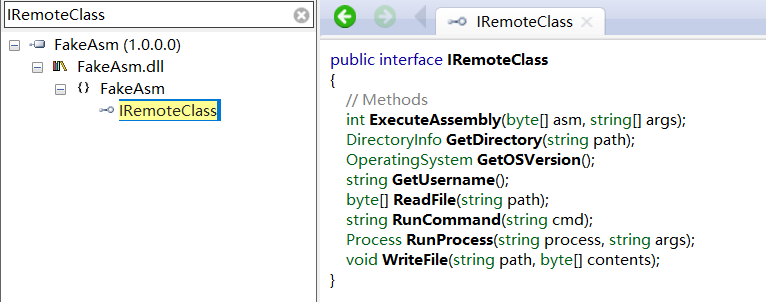