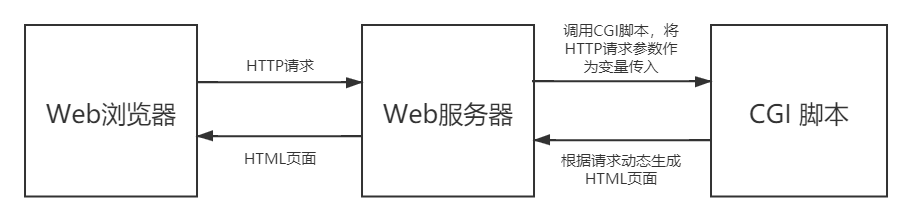

## CVE-2014-6278漏洞分析

### 漏洞介绍

CGI (Common Gateway Interface) 定义了web服务端与其它程序 (CGI脚本) 相互交流的方式。CGI脚本允许程序员使用任何自己熟悉的语言来动态生成网页内容，常用的CGI语言包括C、C++、perl、python、shell等。



Apache提供mod_cgi模块允许使用CGI脚本编程，当web用户通过使用unix shell所编写CGI脚本来访问网页时，HTTP请求头等信息会作为环境变量储存。由于Bash<=4.3版本在处理外部环境变量的过程中存在ShellShock漏洞，攻击者可以在HTTP请求头字段构造触发ShellShock漏洞的payload从而造成的任意命令执行。

### 漏洞分析

输入payload命令

```
curl -H 'User-Agent: () { :; }; echo ; echo ; /bin/cat /etc/passwd' localhost:8080/cgi-bin/cgi-34900
```

使用gdb attach到httpd进程进行调试

```
(gdb) catch fork
Catchpoint 1 (fork)
(gdb) c
Continuing.

Catchpoint 1 (forked process 318), 0x00007f86cd315972 in fork () from /lib64/libc.so.6
(gdb) bt
#0  0x00007f86cd315972 in fork () from /lib64/libc.so.6
#1  0x00007f86cda61104 in apr_proc_create () from /lib64/libapr-1.so.0
#2  0x0000556f909190c7 in ap_unix_create_privileged_process (p=<optimized out>, ugid=<optimized out>, attr=<optimized out>, env=<optimized out>, args=<optimized out>, progname=<optimized out>, 
    newproc=<optimized out>) at unixd.c:192
#3  ap_os_create_privileged_process (r=<optimized out>, newproc=0x556f926d9338, progname=<optimized out>, args=<optimized out>, env=<optimized out>, attr=<optimized out>, p=0x556f926d3958) at unixd.c:208
#4  0x00007f86c1447965 in run_cgi_child (script_out=script_out@entry=0x7ffc805c8940, script_in=script_in@entry=0x7ffc805c8948, script_err=script_err@entry=0x7ffc805c8950, command=<optimized out>, 
    argv=<optimized out>, r=r@entry=0x556f926d39d0, p=p@entry=0x556f926d3958, e_info=e_info@entry=0x7ffc805c8970) at mod_cgi.c:456
#5  0x00007f86c1448b4d in cgi_handler (r=0x556f926d39d0) at mod_cgi.c:829
#6  0x0000556f908fdb80 in ap_run_handler (r=r@entry=0x556f926d39d0) at config.c:169
#7  0x0000556f908fe0c9 in ap_invoke_handler (r=r@entry=0x556f926d39d0) at config.c:439
#8  0x0000556f90912cda in ap_process_async_request (r=0x556f926d39d0) at http_request.c:339
#9  0x0000556f90912fc2 in ap_process_request (r=r@entry=0x556f926d39d0) at http_request.c:374
#10 0x0000556f9090f152 in ap_process_http_sync_connection (c=0x556f926cb990) at http_core.c:190
#11 ap_process_http_connection (c=0x556f926cb990) at http_core.c:231
#12 0x0000556f909071b0 in ap_run_process_connection (c=c@entry=0x556f926cb990) at connection.c:41
#13 0x0000556f90907598 in ap_process_connection (c=c@entry=0x556f926cb990, csd=<optimized out>) at connection.c:202
#14 0x00007f86c49937ef in child_main (child_num_arg=child_num_arg@entry=0) at prefork.c:707
#15 0x00007f86c49939ec in make_child (s=0x556f92629350, slot=slot@entry=0) at prefork.c:749
#16 0x00007f86c4994771 in prefork_run (_pconf=<optimized out>, plog=0x556f9262d358, s=0x556f92629350) at prefork.c:966
#17 0x0000556f908e212e in ap_run_mpm (pconf=pconf@entry=0x556f92600138, plog=0x556f9262d358, s=0x556f92629350) at mpm_common.c:96
#18 0x0000556f908dae86 in main (argc=4, argv=0x7ffc805cd068) at main.c:783
```

从第5层的`modules/generators/mod_cgi.c`的`cgi_handler`函数开始分析：

```
static int cgi_handler(request_rec *r)
{
    [...]
    ap_add_common_vars(r);
    ap_add_cgi_vars(r);
```

可以看到在第805行将收到request传入`ap_add_common_vars`以及`ap_add_cgi_vars`中，在`server/util_scrip.c`的第138行可以看到`ap_add_common_vars`的代码：

```
AP_DECLARE(void) ap_add_common_vars(request_rec *r)
{
    apr_table_t *e;
    server_rec *s = r->server;
    conn_rec *c = r->connection;
    const char *env_temp;
    const apr_array_header_t *hdrs_arr = apr_table_elts(r->headers_in);
    const apr_table_entry_t *hdrs = (const apr_table_entry_t *) hdrs_arr->elts;
    int i;
    apr_port_t rport;
    char *q;

    /* use a temporary apr_table_t which we'll overlap onto
     * r->subprocess_env later
     * (exception: if r->subprocess_env is empty at the start,
     * write directly into it)
     */
    if (apr_is_empty_table(r->subprocess_env)) {
        e = r->subprocess_env;
    }
    else {
        e = apr_table_make(r->pool, 25 + hdrs_arr->nelts);
    }

    /* First, add environment vars from headers... this is as per
     * CGI specs, though other sorts of scripting interfaces see
     * the same vars...
     */

    for (i = 0; i < hdrs_arr->nelts; ++i) {
        if (!hdrs[i].key) {
            continue;
        }

        /* A few headers are special cased --- Authorization to prevent
         * rogue scripts from capturing passwords; content-type and -length
         * for no particular reason.
         */

        if (!strcasecmp(hdrs[i].key, "Content-type")) {
            apr_table_addn(e, "CONTENT_TYPE", hdrs[i].val);
        }
        else if (!strcasecmp(hdrs[i].key, "Content-length")) {
            apr_table_addn(e, "CONTENT_LENGTH", hdrs[i].val);
        }
        /*
         * You really don't want to disable this check, since it leaves you
         * wide open to CGIs stealing passwords and people viewing them
         * in the environment with "ps -e".  But, if you must...
         */
         #ifndef SECURITY_HOLE_PASS_AUTHORIZATION
        else if (!strcasecmp(hdrs[i].key, "Authorization")
                 || !strcasecmp(hdrs[i].key, "Proxy-Authorization")) {
            continue;
        }
		#endif
        else
            add_unless_null(e, http2env(r, hdrs[i].key), hdrs[i].val);
    }
    [...]
}
```

可以看到，`ap_add_common_vars`函数对创建`hdrs_arr`表来存储传入的request中的HTTP headers，并创建了类型为`apr_table_t`的`e `来添加环境变量。在随后的for循环中，读取了request中所有HTTP headers，并添加在`e`中，并最终传入`r->subprocess_env`。因此我们payload中所定义的`User-Agent`也会在这里被添加入环境变量中。

接着在`modules/generators/mod_cgi.c`的第829行，将通过调用`run_cgi_child`在子进程中运行CGI脚本。

```
    /* run the script in its own process */
    if ((rv = run_cgi_child(&script_out, &script_in, &script_err,
                            command, argv, r, p, &e_info)) != APR_SUCCESS) {
        ap_log_rerror(APLOG_MARK, APLOG_ERR, rv, r, APLOGNO(01223)
                      "couldn't spawn child process: %s", r->filename);
        return HTTP_INTERNAL_SERVER_ERROR;
    }
```

查看`modules/generators/mod_cgi.c`的`run_cgi_child`函数，可以看到在第410行读取了`r->subprocess_env`中的值传入`env`，并在第456行在调用`ap_os_create_privileged_process`函数时将`env`将做参数传入。

```
static apr_status_t run_cgi_child(apr_file_t **script_out,
                                  apr_file_t **script_in,
                                  apr_file_t **script_err,
                                  const char *command,
                                  const char * const argv[],
                                  request_rec *r,
                                  apr_pool_t *p,
                                  cgi_exec_info_t *e_info)
{
	[...]
	env = (const char * const *)ap_create_environment(p, r->subprocess_env);
	[...]
	rc = ap_os_create_privileged_process(r, procnew, command, argv, env,
                                             procattr, p);

```

在本篇paper中主要分析环境变量的创建与传递，至于CGI程序的创建过程就不再赘述。最终HTTP请求头作为环境变量被传入bash中执行，通过ShellShock漏洞造成任意命令执行。