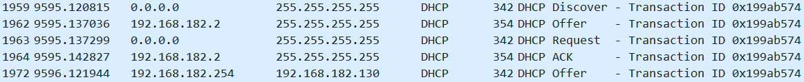

## CVE-2014-7187漏洞分析

### 漏洞介绍

动态主机设置 (DHCP) 是通过UDP协议对网络配置信息 (如IP地址) 进行动态分配的通信协议。当局域网中有客户端接入时，会广播一个DHCP Discover请求包，当DHCP服务器收到后，会为客户端申请一个IP地址并将其包含到DHCP Offer包中返回给客户端。由于Bash<=4.3版本在处理外部环境变量的过程中存在ShellShock漏洞，攻击者可以伪造DHCP服务器的应答包，并通过在DHCP Options中选择字段构造触发ShellShock漏洞的payload就可以造成客户端的任意命令执行。


### 漏洞分析

运行攻击脚本`exp.py`，使用Wireshark抓包可以验证过程，其中No.1962和No.1964为攻击主机伪造成DHCP服务器 (IP地址为192.168.182.2) 发送给目标主机的DHCP请求回复。注意到No.1972的数据包是由真正的DHCP服务器发送的DHCP Offer。



查看我们发送的恶意DHCP Offer包可以看到在DHCP Options的`Merit Dump File`字段中包含我们构造的payload，它将会作为环境变量被Bash执行。


使用gcore命令获取dhclient执行payload后的core dump文件

```
gcore -o core_file dhclient_pid
```

接着使用gdb对core dump文件进行调试

```
gdb dhclient core_file.dhclient_pid
```


本paper所分析的dhclient版本为`dhcp-4.1-ESV-R4`，[源码地址](http://ftp.isc.org/isc/dhcp/4.1-ESV-R4/dhcp-4.1-ESV-R4.tar.gz)。

首先从`client/dhclient.c`中的`main`函数开始分析，首先程序从`argv`参数读取用户输入的选项，其中在第242行读取的`-e`选项允许用户自定义环境变量，并储存在`client_env`变量中。

```
int
main(int argc, char **argv) 
{
[...]
for (i = 1; i < argc; i++) {
		if (!strcmp(argv[i], "-r")) {
			} 
		else if (!strcmp(argv[i], "-e")) {
			struct string_list *tmp;
			if (++i == argc)
				usage();
			tmp = dmalloc(strlen(argv[i]) + sizeof *tmp, MDL);
			if (!tmp)
				log_fatal("No memory for %s", argv[i]);
			strcpy(tmp->string, argv[i]);
			tmp->next = client_env;
			client_env = tmp;
			client_env_count++;
			}
[...]
```

接着在第347行调用了`common/tables.c`中所定义的` initialize_common_option_spaces`函数对储存了DHCP options内容的结构进行了初始化。

```
void initialize_common_option_spaces()
{
	unsigned code;
	int i;

	/* The 'universes' table is dynamically grown to contain
	 * universe as they're configured - except during startup.
	 * Since we know how many we put down in .c files, we can
	 * allocate a more-than-right-sized buffer now, leaving some
	 * space for user-configured option spaces.
	 *
	 * 1: dhcp_universe (dhcpv4 options)
	 [...]
	  */
	 	/* Set up the DHCP option universe... */
	dhcp_universe.name = "dhcp";
	[...]
	for (i = 0 ; dhcp_options[i].name ; i++) {
		option_code_hash_add(dhcp_universe.code_hash,
				     &dhcp_options[i].code, 0,
				     &dhcp_options[i], MDL);
		option_name_hash_add(dhcp_universe.name_hash,
				     dhcp_options [i].name, 0,
				     &dhcp_options [i], MDL);
	}
	[...]
```

其中`dhcp_universe`以及`dhcp_options`结构在`common/tables.c`中定义，可以看到其中包含我们所使用的`merit dump file`字段。


回到`client/dhclient.c`中的第517行

```
	[...]
	}else{
		script_init(ip->client, "PREINIT", NULL);
		if (ip->client->alias != NULL)
			script_write_params(ip->client,"alias_",ip->client->alias);
	}
		script_go(ip->client);
	[...]
```

跟进`script_write_params`看：

```
void script_write_params (client, prefix, lease)
	struct client_state *client;
	const char *prefix;
	struct client_lease *lease;
{
	int i;
	struct data_string data;
	struct option_cache *oc;
	struct envadd_state es;
	[...]
	for (i = 0; i < lease -> options -> universe_count; i++) {
		option_space_foreach ((struct packet *)0, (struct lease *)0,
				      client, (struct option_state *)0,
				      lease -> options, &global_scope,
				      universes [i],
				      &es, client_option_envadd);
	}
	client_envadd (client, prefix, "expiry", "%d", (int)(lease -> expiry));
}
```

其中`client_option_envadd`获取DHCP包中的option并使用`check_option_values`函数对参数进行检查，看是否存在非法字符串，若符合要求则继续传入到`client_envadd`中。

```
void client_option_envadd (struct option_cache *oc,
			   struct packet *packet, struct lease *lease,
			   [...], struct universe *u, void *stuff)
{
	[...]
	if (evaluate_option_cache (&data, packet, lease, client_state,
				   in_options, cfg_options, scope, oc, MDL)) {
		if (data.len) {
			char name [256];
			if (dhcp_option_ev_name (name, sizeof name,
						 oc->option)) {
				const char *value;
				[...]
				if (check_option_values(oc->option->universe,
							oc->option->code,
							value, length) == 0) {
					client_envadd(es->client, es->prefix,
						      name, "%s", value);
				} else {
					log_error("suspect value in %s "
						  "option - discarded",
						  name);
				}
				data_string_forget (&data, MDL);
			}
		}
	}
}
```

由于在`check_option_values`只对部分字段 (如`DHO_DOMAIN_NAME`，`DHO_ROOT_PATH`) 的内容进行了检查，因此使用其它未被检测的option字段可以绕过

```
static int check_option_values(struct universe *universe,
			       unsigned int opt,
			       const char *ptr,
			       size_t len)
{
	if (ptr == NULL)
		return(-1);

	/* just reject options we want to protect, will be escaped anyway */
	if ((universe == NULL) || (universe == &dhcp_universe)) {
		switch(opt) {
		      case DHO_DOMAIN_NAME:
#ifdef ACCEPT_LIST_IN_DOMAIN_NAME
			      return check_domain_name_list(ptr, len, 0);
#else
			      return check_domain_name(ptr, len, 0);
#endif
		      case DHO_HOST_NAME:
		      case DHO_NIS_DOMAIN:
		      case DHO_NETBIOS_SCOPE:
			return check_domain_name(ptr, len, 0);
			break;
		      case DHO_DOMAIN_SEARCH:
			return check_domain_name_list(ptr, len, 0);
			break;
		      case DHO_ROOT_PATH:
			if (len == 0)
				return(-1);
			for (; (*ptr != 0) && (len-- > 0); ptr++) {
				if(!(isalnum((unsigned char)*ptr) ||
				     *ptr == '#'  || *ptr == '%' ||
				     *ptr == '+'  || *ptr == '-' ||
				     *ptr == '_'  || *ptr == ':' ||
				     *ptr == '.'  || *ptr == ',' ||
				     *ptr == '@'  || *ptr == '~' ||
				     *ptr == '\\' || *ptr == '/' ||
				     *ptr == '['  || *ptr == ']' ||
				     *ptr == '='  || *ptr == ' '))
					return(-1);
			}
			return(0);
			break;
		}
	}
```

接着`client_envadd`函数将通过检测的环境变量赋值给`client -> env`

```
void client_envadd (struct client_state *client,
		    const char *prefix, const char *name, const char *fmt, ...)
{
	[...]
	s = val -> string;
	strcpy (s, prefix);
	strcat (s, name);
	s += strlen (s);
	*s++ = '=';
	if (len >= sizeof spbuf) {
		va_start (list, fmt);
		vsnprintf (s, len + 1, fmt, list);
		va_end (list);
	} else
		strcpy (s, spbuf);
	val -> next = client -> env;
	client -> env = val;
	client -> envc++;
}
```

最终在`main`函数的第524行调用`script_go`函数中将之前用户配置的`client_env`以及从DHCP options字段中获取的`client -> env`都保存在了数组`envp`中。

```
int script_go (client)
	struct client_state *client;
{
	[...]
	i = 0;
	/* Copy out the environment specified on the command line,
	   if any. */
	for (sp = client_env; sp; sp = sp -> next) {
		envp [i++] = sp -> string;
	}
	/* Copy out the environment specified by dhclient. */
	if (client) {
		for (sp = client -> env; sp; sp = sp -> next) {
			envp [i++] = sp -> string;
		}
	} else {
		envp [i++] = reason;
	}
	[...]
		execve (scriptName, argv, envp);
		log_error ("execve (%s, ...): %m", scriptName);
		exit (0);
	}
```

最后在调用`execve`将环境变量传入执行。

应对措施：更新bash版本并将需要过滤的DHCP option字段添加到`client/dhclient.c`文件中的`check_option_values`函数中。更改之后重新编译运行可以看到payload不会被执行。


