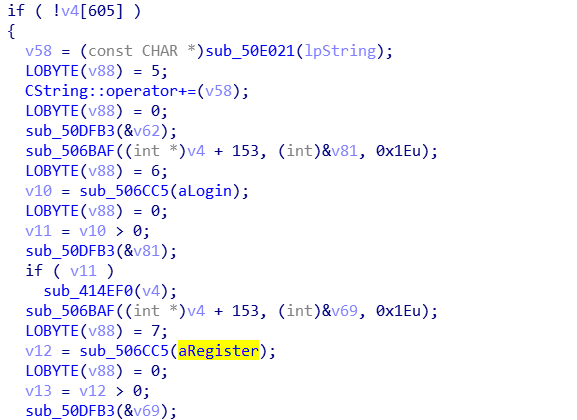

## CVE-2014-9439漏洞分析

### 漏洞介绍

Easy File Sharing Web Server 6.8版本由于为对username字段进行过滤，攻击者可注册包含XSS payload的用户名从而造成持久化跨站脚本攻击。

### 漏洞分析

编写python脚本实现自动化用户注册：

```
import requests

url = "http://192.168.182.186/register.ghp"
data = {
    "frmLogin": "true",
    "frmUserID": "<script>alert('xss1')</script>",
    "frmUserPass": "123456",
    "frmUserPass2": "123456",
    "Email": "1231@123.com",
    "Avatar": "",
    "avatarURL": "",
    "register": "Register!"
    }
res = requests.post(url, data=data)
print(res.text)
```

通过IDA打开fsws.exe文件，首先在程序的.data段找到注册页面`register.ghp`字符串地址。


通过查看引用可以发现一共有两条路径引用了这个字符串，分别为sub_4ABCA0和sub_42D390。


从sub_40F850开始查看，从IDA反编译的代码可知在第193行调用了WSARecv()函数。


其定义如下，对应返汇编代码中v2为接收到来自客户端的socket，&Buffers为一个指向[WSABUF](https://docs.microsoft.com/en-us/windows/desktop/api/ws2def/ns-ws2def-wsabuf)的指针，1u表示buffer数目，&NumberOfBytesRecvd表示接收数据的字节数。


对应的反汇编代码如下。


计算得到汇编指令`call ds:WSARecv`的地址并使用WinDbg下断点调试。


执行完成之后程序会接收到来自客户端的HTTP POST请求，并将其保存在栈中。通过`lea eax, [esp+18A1Ch+var_186AC]`将其传给eax寄存器。我们可以打印一下eax中的值查看其内容：


在调用了WSARecv()函数后将进入sub_42D390函数中，其中接收到的请求内容将通过eax作为参数传入。查看函数的反编译代码可知在sub_506CC5处进行了和用户注册相关的功能。



继续运行到fsws+0xfb91可以看到此时eax中已经存有Eeasy File Sharing Web Server的HTTP响应：


最后调用WSASend将HTTP响应发送给客户端。


查看客户端接收到的HTML代码，提示注册成功，说明程序没有对用户名进行任何过滤。


此时查看Easy File Sharing Web Server程序GUI中的User Account界面，可以看到我们注册的包含XSS payload的用户名。

