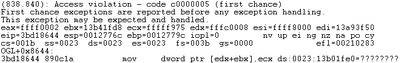
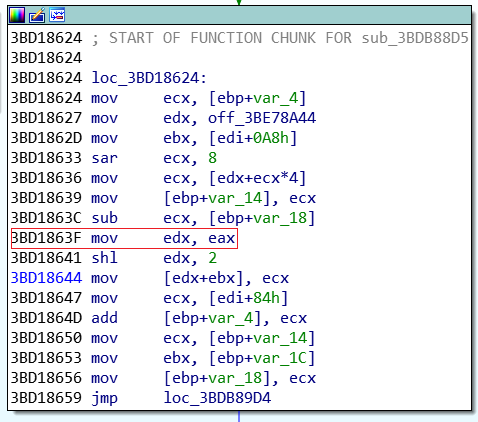

## CVE-2015-2431漏洞分析

### 漏洞介绍

Microsoft Office 2007中的OGL.dll在解析doc文档时存在错误，导致内存越界写，可使程序崩溃。

### 漏洞分析

通过Linux提供的cmp命令可以对比1863274449_min.doc (造成Word程序崩溃的文档) 和1863274449_orig.doc (正常文档) 内容的区别。

```
cmp -l 1863274449_min.doc 1863274449_orig.doc | gawk '{printf "%08X %02X %02X\n", $1, strtonum(0$2), strtonum(0$3)}'
```

输出如下所示，在偏移为0x4A46处存在一个bit的差异：

```
00004A46 80 00
```

使用OffVis打开1863274449_min.doc文档，可以看到0x4A46偏移处所对应的字段名为：`OLESSRoot.DirectoryEntries[100].OLESSDirectoryEntry[20].sidLeft`


使用WinDbg附加在WINWORD.EXE进程中调试，打开1863274449_min.doc文档。输入`g`命令让程序运行直至崩溃，可以看到产生错误的程序地址为0x3bd18644，错误原因是Access violation，即当向[edx+ebx]所指向的内存地址写数据时产生了错误。其中ebx指向了一个由OGL!DpOutputSpanStretch<1>::InitializeClass所分配的大小为24的内存，而edx的值却超过了内存分配大小，从而导致了内存越界写。



使用`kb`命令可以看到程序的函数调用栈，可知漏洞触发的模块存在于OGL.dll：


使用IDA打开OGL.dll，找到相应漏洞触发的地址。由上面的分析可知ebx是越界写产生的原因，在代码`mov [edx+ebx], ecx`之前可以看到edx由`mov edx, eax`赋值。因此我们需要继续追踪eax的值。



根据漏洞发现者提供的[文章](https://code.google.com/p/google-security-research/issues/detail?id=420&can=1)可知，eax在该函数漏洞触发之前被循环更新，并最终成为0xfffc0008。相关代码在IDA中如下：


在地址为0x3bdb893d处的`sar esi,10h`将esi的值进行了带符号右移，因此当esi的最高位为1时，右移后的结果将如下所示，esi由0x80007fff变成了0xffff8000：


继续单步运行，可以看到在0x3bd18644处触发了越界写。


而打开1863274449_orig.doc ，在相同地址下断点，可以看到edx的值为0，并没有超出分配内存的大小。

