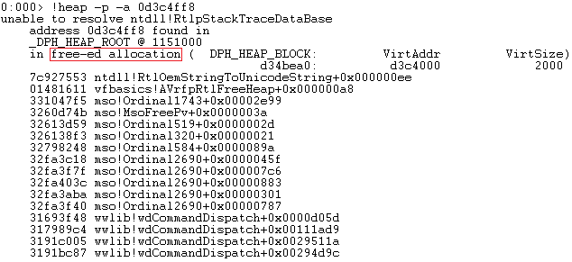

## CVE-2015-2467漏洞分析

### 漏洞介绍

Microsoft Office 2007 SP3的mso.dll在处理doc文档中的OneTableDocumentStream.Data字段时存在错误，远程攻击者存在通过精心制作的文档从而实现引用已经释放的内存的可能性。

### 漏洞分析

通过Linux提供的cmp命令可以对比1567070353_min.doc (造成Word程序崩溃的文档) 和1567070353_orig.doc (正常文档) 内容的区别。

```
cmp -l 1567070353_min.doc 1567070353_orig.doc | gawk '{printf "%08X %02X %02X\n", $1, strtonum(0$2), strtonum(0$3)}'
```

输出如下所示，在偏移为0x11E61处以及0x15160处分别存在一个bit的差异：

```
00011E61 00 01
00015160 05 01
```

使用OffVis打开1567070353_min.doc文档，可以看到偏移0x11E61和0x15160所处的字段都为`WordBinaryDocuments[1].WordBinaryDocument[0].OneTableDocumentStream.Data`。


使用WinDbg附加WINWORD.EXE进程进行调试，输入`g`命令让程序继续运行直到崩溃，可以看到产生错误的地址为0x32fa3c1b，错误的原因在于Access violation，即访问了非法地址`edi+2`。


输入`kb`命令查看函数调用栈，可以看到漏洞触发对应的模块为mso.dll，函数位置为Ordinal2690+0x462。


查看edi中所存放的地址0x0d3c4ff8信息，可以看到这是一块已经释放了的地址，因此可能造成Use After Free。



使用IDA中打开mso.dll，在函数sub_32FA3B93中找到触发错误相应的代码片段，可以看到edi的值来源于`mov edi, [ebp+var_8]`。


让我们重新打开WinDbg调试该程序，将断点下在0x32FA3C12处，由`mov edi, [ebp-8]`可知，var_8的值为-8。


在函数开头可以看到`[ebp+var_8]`来源于0x32FA3BC3处的`mov [ebp+var_8], ebx`。而ebx的值又来源于0x32FA3BB9的`mov ebx, [esi+0Ch]`。其中esi的值来源于0x32FA3BA4处的`mov esi, ecx`，而ecx则来源于上层函数。


在出现故障的eip位置之后的0x32FAC34处，通过`and dword ptr [edi], 0FFFEFFFFh`，使得在edi指向的地址清除了一个1位，这也使它成为可利用的条件。

