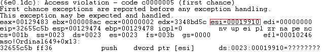
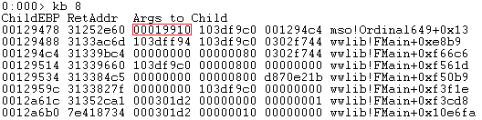
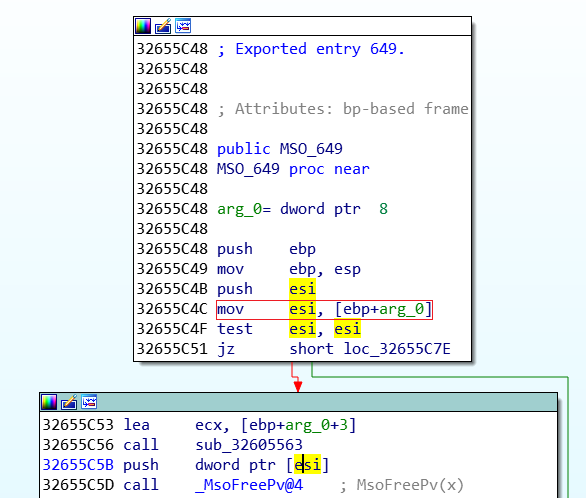
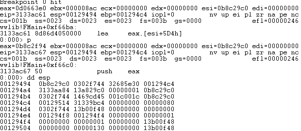
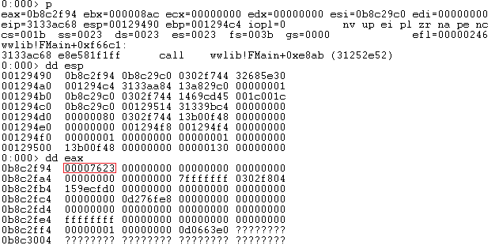
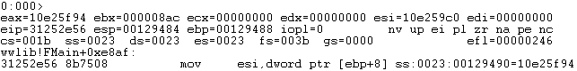
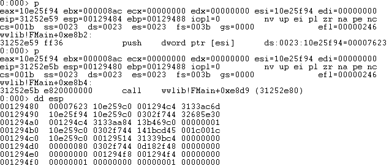
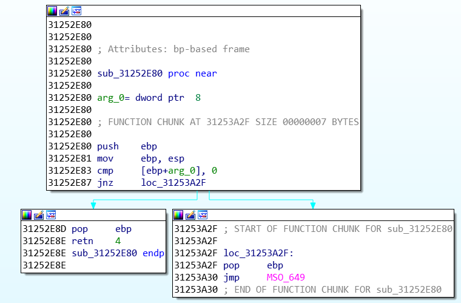
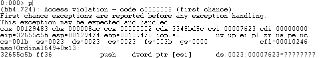
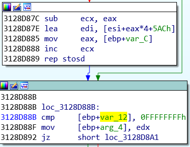

## CVE-2015-2468漏洞分析

### 漏洞介绍

由于Microsoft Office 2007的mso.dll模块在处理doc文档时存在问题，可能导致任意内存释放漏洞。

### 漏洞分析

使用WinDbg附加在WINWORD.EXE进程上进行调试，打开2435406723_crash.doc文件，输入`g`命令让程序运行直至崩溃，可以看到产生崩溃的地址为0x32655c5b，原因在于esi所指向的内存不可访问。

查看函数调用栈，可以看到漏洞触发的模块在mso.dll中。

在IDA中打开mso.dll，找到相应地址，可以看到esi的值来自于`mov esi, [ebp+arg_0]`中的`[ebp+arg_0]`。根据图二的函数调用参数 (红框) 中可以看到，`[ebp+arg_0]`的值是作为上一个函数 (wwlib!FMain+0xe8b9) 的调用参数传入给mso!Ordinal649+0x13的。

让我们重新将断点下在函数调用栈的Level 2函数wwlib!FMain+0xf66c6处：

运行直至断点，可以看到在`lea eax, [esi+5D4h]`处将`[esi+5D4h]`的偏移赋给了eax，再将eax压栈。

继续运行，调用函数地址0x31252e52，也就是调用栈中的Level 1函数。查看eax指向的内存中存放的值，可以看到为0x00007623。

步入函数之后，会将上一个函数通过`push eax`传递的参数 (也就是0x00129490) 通过`mov esi,dword ptr [ebp+8]`传递到esi。

接着，将[esi]地址中存放的值 (也就是0x00007623) 压栈并调用0x31252e80函数。

该函数在IDA中如下图所示，继续执行将在0x31253a30处通过`jmp MSO_649`跳转到mso.dll模块执行。

跳转进入mso!Ordinal649之后，将之前压入栈中的[esi]所存储的值 (0x00007623) 赋值给esi。

并在漏洞触发处通过`push dword ptr [esi]`试图访问非法的内存地址 (0x00007623) 从而触发Access violation错误。

根据漏洞发现者的文章，最开始的`[esi+5D4h]`所指向地址是由下面这段代码所决定的。

在最后作者还提到，如果想要利用这个漏洞，攻击者需要在受到攻击的机器上喷洒内存，直到虚拟地址0x00019000被分配给正在运行的程序。接着需要在偏移为0x910的内存页中存放攻击者希望释放的内存地址，从而导致任意内存释放漏洞。