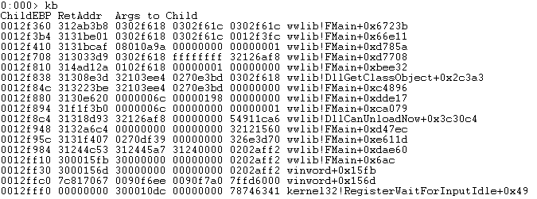

## CVE-2015-2469漏洞分析

### 漏洞介绍

Microsoft Office 2007中的wwlib.dll在解析doc文档中存在错误，导致ebx指针被篡改，可使程序崩溃。

### 漏洞分析

通过Linux提供的cmp命令可以对比min.doc和orig.doc文档内容的区别。

```
cmp -l 1981563878_min.doc 1981563878_orig.doc | gawk '{printf "%08X %02X %02X\n", $1, strtonum(0$2), strtonum(0$3)}'
```

输出如下所示，分别在偏移为0x2405，0x4042，0x8058存放的字节处存在一个bit的差异。

```
00002405 18 1A
00004042 93 13
00008058 81 89
```

在OffVis中查找相应偏移对应的字段，可以看到偏移0x2405的数据对应的完整字段路径为：`WordBinaryDocuments[1].WordBinaryDocument[0].stPapxFKPs[23].PAPXFKP[1].rgfc[7].rgfc[1]`。


其中0x18为经过篡改的字节，原文件在此处的值为0x1A。


相似地，偏移0x4042处的数据对应的字段为`WordBinaryDocuments[1].WordBinaryDocument[0].stPapxFKPs[23].PAPXFKP[9].rgfc[23].rgfc[16]`。


偏移0x8058处的数据对应的字段为`WordBinaryDocuments[1].WordBinaryDocument[0].stPapxFKPs[23].PAPXFKP[22].rgbx[11].BXPAP[3].bOffset`。


根据发现该漏洞的[Google Security Research](https://code.google.com/p/google-security-research/issues/detail?id=423&can=1)所提供的分析可知其通过调试观察到的crash位置在于0x312ABB73的`push dword ptr [eax+0xB8h]`处。我们在IDA中可以找到如下代码片段，可知在经过一系列push操作后最终调用了sub_312AB96F函数。


接着让我们使用WinDbg附加在WINWORD.EXE进程上，打开min.doc文件，在0x312ABB73处下断点并使用`g`命令让程序运行直至断点。可以看到该代码段的执行过程如下：


根据漏洞发现者的分析，eax所指向的内存所分配大小为a8，由于在上面代码中push到栈上的内存index分别为eax +0xB8, +0xB0, +0xB4, 和+0xAC，它们都大于内存分配大小a8 。

接着进入sub_312AB96F函数中可以看到它使用传入参数进行了写内存的操作，因此漏洞发现者认为该漏洞是可以进一步利用造成内存污染甚至是任意命令执行。


但是在我们的环境中查看该内存块可以看到大小为2ee8。因此push进去的参数index并没有超出内存，不能造成利用。


使用`kb`命令查看程序调用栈：


输入`g`让程序继续运行直至报错：


可以看到出错的原因在于[ebx+10h]所指向的内存地址0x15150a34不可访问。此时可以看到函数调用栈：



因此可以猜测wwlib.dll在解析doc文档中存在错误，导致ebx指针被篡改，可使程序崩溃造成DoS攻击。