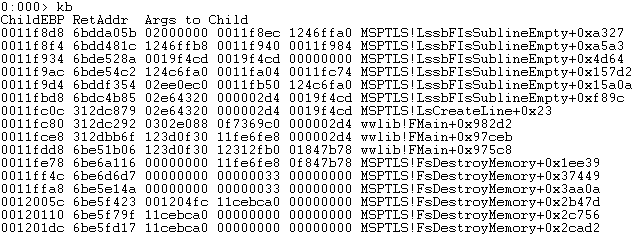
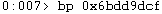

## CVE-2015-2470漏洞分析

### 漏洞介绍

由于Microsoft Office 2007的MSPTLS.dll模块在解析doc文档的OneTableDocumentStream.Data字段时存在错误，导致数负向溢出漏洞，可使得程序对未经允许访问的内存进行写操作。

### 漏洞分析

通过Linux提供的cmp命令可以对比3423415565_min.doc (造成Word程序崩溃的文档) 和3423415565_orig.doc (正常文档) 内容的区别。

```
cmp -l 3423415565_min.doc 3423415565_orig.doc | gawk '{printf "%08X %02X %02X\n", $1, strtonum(0$2), strtonum(0$3)}'
```

输出如下所示，在偏移为0xA9B1处存在一个bit的差异：

```
0000A9B1 CF EF
```

使用OffVis打开3423415565_min.doc文档，可以看到偏移0xA9B1处的字段对应为`WordBinaryDocuments[1].WordBinaryDocument[0].OneTableDocumentStream.Data`。


使用WinDbg附加WINDORD.EXE进程进行调试，输入`g`命令运行直至程序崩溃，可以看到触发错误的地址为0x6bdd9ddf，错误信息为Access violation。由于esi的值为0，导致`[esi+70h]`指向不可访问的0x00000070，从而触发程序异常。


使用`kb`命令查看程序调用栈，可知漏洞触发模块为MSPTLS.dll中的LssbFIsSublineEmpty函数。



在IDA中打开MSPTLS.dll，并找到错误触发的地址，可以看到esi来自于0x6bdd9dd6处的`mov esi, [ecx+18h]`。


重新使用WinDbg附加进程调试，在该代码段开头的0x6bdd9dcf处下断点。



令程序继续运行到断点，此时edi的值为1，因此eax的值为正，`add ecx, eax`后ecx的值增加了1c。此时执行到`mov edx, [esi+70]`不会触发错误。


继续输入`g`，程序将多次运行到断点，当观察到edi的值为0xfffffffe时开始单步运行程序进行调试。


可以看到执行了`add ecx,eax`后，ecx从0x12524f20减小到了0x12524ee8，减小了0x38。因此当进行`mov esi, dword ptr [ecx+18h]`操作时，相当于`[ecx-38h+18h]`，访问的内存向前越界，从而导致esi被存入了不应该有的值0xabcdbbbb。


继续运行直到程序错误产生的地方，可以看到提示0xabcdbc2b (也就是0xabcdbbbb+0x70) 地址不可访问。


我们可以查看ecx在与eax相加之前时存放地址对应的内存情况。


因此通过上面的调试我们可以判断，程序错误的原因在：由于edi的值为负，因此由edi赋值给eax的值也为负，所以在`add ecx,eax`时ecx作为指针向前移动了。从而导致在`mov esi, dword ptr [ecx+18h]`中的索引向前越界访问，最终导致`[esi+70]`指向了非法内存。

