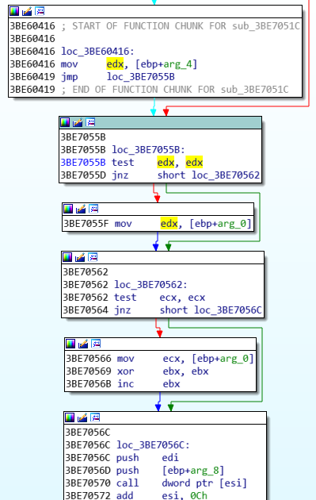

## CVE-2015-2510漏洞分析

### 漏洞介绍

微软Office 2007中的 OGL.dll未能够对内存访问进行正确的边界检查，从而导致内存越界读写。

### 漏洞分析

通过Linux提供的cmp命令可以对比3013413838_min.xls (造成Excel程序崩溃的文档) 和3013413838_orig.xls (正常文档) 内容的区别。

```
cmp -l 3013413838_min.xls 3013413838_orig.xls | gawk '{printf "%08X %02X %02X\n", $1, strtonum(0$2), strtonum(0$3)}'
```

输出如下所示，存在13处差异：

```
00000229 04 0B
0000022C 75 43
0000022D 73 68
0000022E 65 61
0000022F 72 73
000013A0 AA 2A
0000A66D 40 B0
0000A66E 60 EB
0000A66F C5 15
0000A670 4A A1
0000A671 4C 96
0000A672 B3 2F
0000A673 D0 CC
```

使用OffVis打开3013413838_min.xls文档，可以看到偏移0x229处的字段对应为`ExcelBinaryDocuments[1].ExcelBinaryDocument[0].Globals.BIFFRecords[145].BIFFRecorf_General[4].Data`。在这个字段中一个有四个字节存在差异，在下图分别用红色框圈出。


在偏移为0x13A0的字段名称为`ExcelBinaryDocuments[1].ExcelBinaryDocument[0].Globals.BIFFRecords[145].MSODrawingGroup[139].rgChildRec.remainingData`，差异为一个字节。


从偏移0xA66D开始，字段名称为`OLESSRoot.DirectoryEntries[4].OLESSDirectoryEntry[0].ModifyTime`，除了最后一个字节与原始文件相同之外，其它都经过了修改。


使用WinDbg附加EXCEL.EXE进程进行调试，输入`g`命令运行直至程序崩溃，可以看到触发错误的地址为0x3bd18f14，错误信息为Access violation。由于`[eax+1]`指向不可访问的0x8949e1a2，从而触发程序异常。


使用`kb`命令查看程序调用栈，可知漏洞触发模块为OGL.dll。


在IDA中打开OGL.dll，可以看到在漏洞触发函数sub_3BD18F07中，eax来自指令`lea eax, [edx+1]`，因此非法的地址0x8949e1a0从edx传递到了eax中并最终触发地址Access Violation错误。


查看上层函数的返回地址0x3be70572，可以看到上层函数是通过`call dword ptr [esi]`来调用函数sub_3BD18F07，同时将edx寄存器中的参数 (0x8949e1a0) 传入漏洞触发函数sub_3BD18F07。而edx又来源于`mov edx, [ebp+arg_0]`。



再次使用WinDbg调试，在`call dword ptr [esi]`指令执行前下条件断点，当[esi]指向地址中存放的函数地址为sub_3BD18F07时停止运行。


停下后可确认edx的值确实为0x89xxe1a0 (其中'xx'为不固定的值，每次重启程序将改变)。


继续向上追溯，可以看到在函数sub_3BDA3A97中栈地址0x0013d964在0x3bda3bb9被写入，指令为`mov [eax+10], edi`，此时edi的值为0x89xxe1a0。IDA中的代码如下所示：


使用WinDbg调试可以验证：


而edi的值则是在同一函数中的如下指令产生：


使用WinDbg调试可以验证。可以看到在`imul edi, ebx`中edi的值为0x0000666e，edx为0x00013350。edi的值为0x0000666e*0x00013350+0x0e42f540=0x8938E1A0，为一个非法的地址。


由于在0x0e75f540地址分配的堆大小为0x15156，小于0x0000666e*0x00013350=0x7AF5EC60，因此`add edi, [ebp+0Ch]`得到的地址会越界。


由于该函数缺乏边界检查，将可能导致内存数据污染。例如，若ebx的值从0x13350增加到0x27fd0，则将得到的edi值为0xffffcb60 (0x666e * 0x27fd0 = 0xffffcb60)，并可能导致在后面的代码中进行越界写操作。

