## CVE-2015-2520漏洞分析

### 漏洞介绍

Microsoft Excel 2007在处理BIFFRecord_General Length数据时存在错误，允许远程攻击者通过精心制作的 Office 文档引用已经释放的内存区域。

### 漏洞分析

通过Linux提供的cmp命令可以对比1105668828_min.xls (造成Excel程序崩溃的文档) 和1105668828_orig.xls (正常文档) 内容的区别。

```
cmp -l 1105668828_min.xls 1105668828_orig.xls | gawk '{printf "%08X %02X %02X\n", $1, strtonum(0$2), strtonum(0$3)}'
```

输出如下所示，在偏移0x1CF7F以及0x3A966处分别存在一个bit的差异：

```
0001CF7F 42 02
0003A966 04 00
```

使用OffVis打开1105668828_min.xls文档，可以看到偏移0x1CF7F处的字段对应的路径为`ExcelBinaryDocuments[1].ExcelBinaryDocument[0].Worksheets[43].SubStream[0].BIFFRecords[1483].BIFFRecord_General[832].Length`。

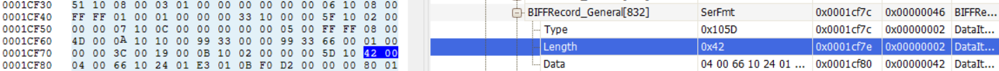

而偏移0x3A966处的字段对应路径类似，结尾为`BIFFRecord_General[524].Length`

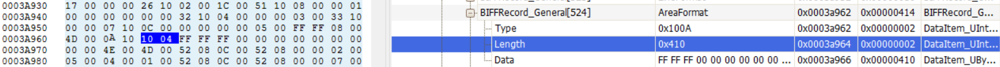

使用WinDbg附加EXCEL.EXE进程进行调试，输入`g`命令运行直至程序崩溃，可以看到触发错误的地址为0x3033ee32，错误信息为Access violation。原因在于esi所指向的地址0x0e696ff0不可访问。

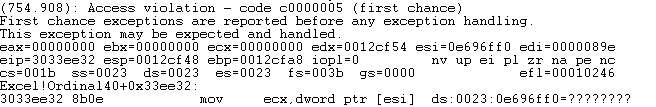

使用`kb`命令查看函数调用栈，可知产生错误的程序为Excel.exe中的Ordinal40函数加上0x33ee32的偏移地址。

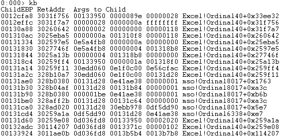

查看esi指向的地址0x0e696ff0的信息，可以看到该地址已经被释放，因此产生了Use-After-Free漏洞。

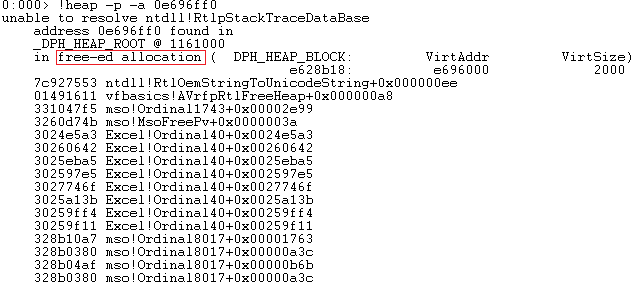

使用IDA打开EXCEL.exe，进入地址0x3033ee32所在函数，可以看到esi来源于0x3033ee2f处的`mov esi, [bep+arg_10]`，根据函数开头定义可知，arg_10为18h。因此esi是来源于上级函数调用所传入的参数。

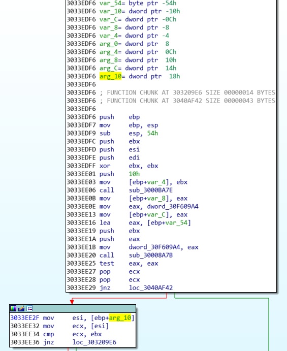

找到上级调用函数，可以看到从0x3031f740开始经过一系列push传入参数，猜测其中`push [ebp+var_2034]`对应着被调用函数中`[ebp+arg_10]`的值。

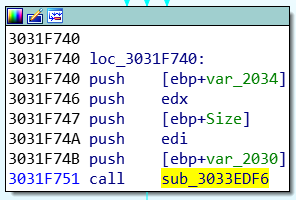

为了验证，再次使用WinDbg挂载调试EXCEL.exe程序，将断点下在漏洞函数调用前。


输入`g`命令让程序继续运行，程序到达断点，可以看到` [ebp+var_2034]`中的值确实对应着被调用函数中`[ebp+arg_10]`的值，为0x0b13cff0。

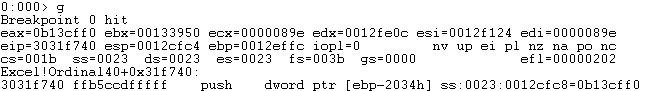

继续使用`t`命令单步运行，push操作结束过后将调用漏洞触发函数0x3033edf6。

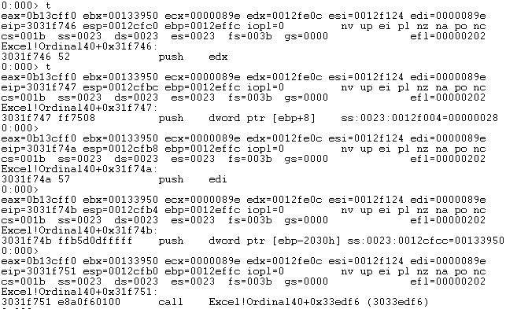

进入函数后，可以验证在`[ebp+18]`处的值确实为0x0b13cff0。

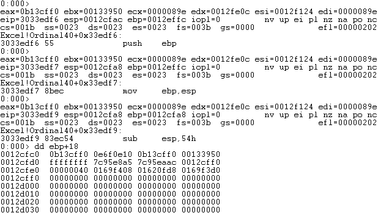

继续向上找` [ebp+var_2034]`的来源，可以看到在0x3031F71B中的一段代码得到的eax对` [ebp+var_2034]`进行了赋值：

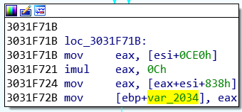

继续使用WinDbg进行调试，将断点下在0x3031F71B处。

输入`g`命令让程序继续运行，程序将多次经过断点，而在最后一次经过时会触发Access Violation错误。

下面是倒数第二次经过断点时的程序运行过程：

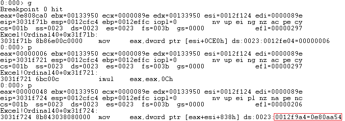

下面是最后一次经过断点时的程序运行过程：

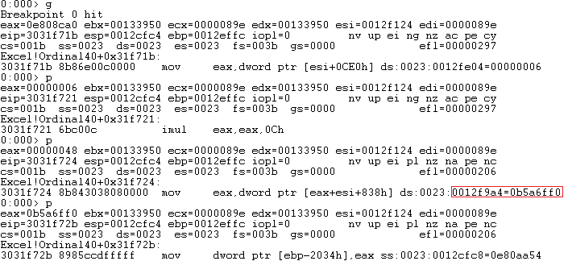

可以看到在`mov eax,dword ptr [eax+esi+838h]`中对eax进行了赋值，而eax的值接着传给` [ebp+var_2034]`并最终传递到漏洞触发代码处引发内存的非法访问。对比两次的运行过程，可以看到其它的值都没有变化，除了`[eax+esi+838h]`地址0x0012f9a4中存放的值，分别为0x0e80aa54和0x0b5a6ff0。推测该段代码多此解析xls文档中的数据，并因为处理异常数据时存在错误，导致了内存被错误更改，并最终使得指针指向了已经被释放的内存。