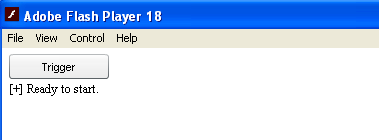
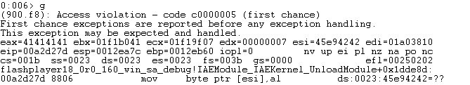
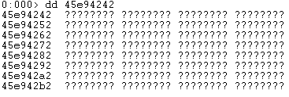
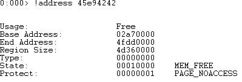
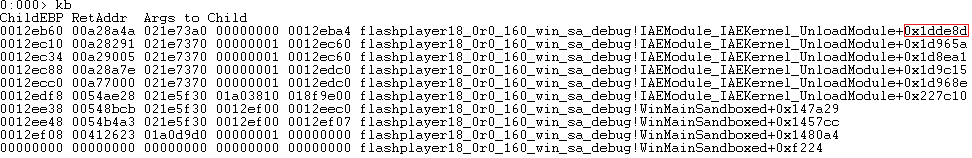
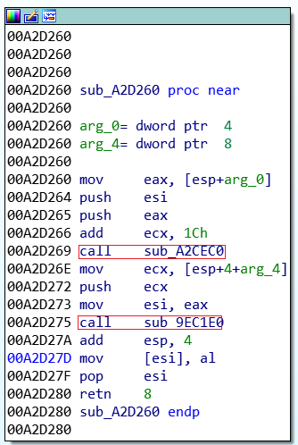
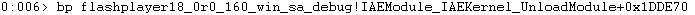
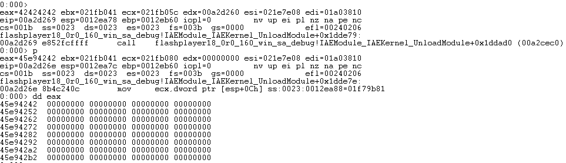
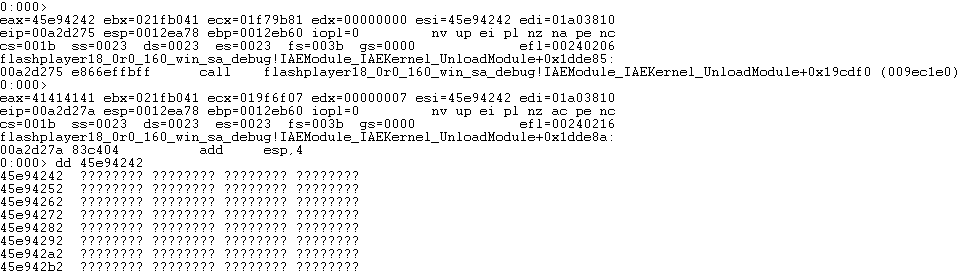
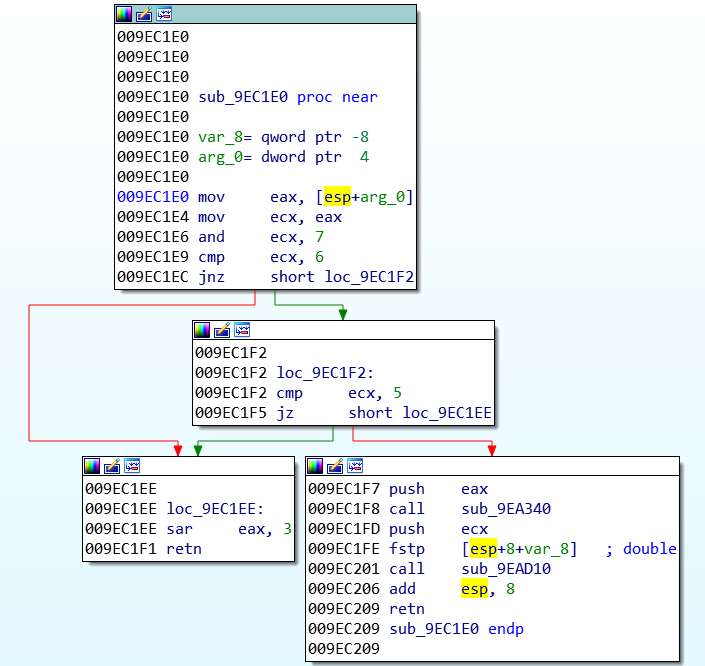

## CVE-2015-5119漏洞分析

### 漏洞介绍

由于Adoble Flash的ByteArrayObject :: setUintProperty函数在处理ByteArray对象赋值时存在处理不当，导致攻击者可以通过覆盖valueOf函数的方法，首先释放已经分配的ByteArray对象内存，并操控这些已经被释放的区域，最终可能达到任意代码执行的目的。

### 漏洞分析

为了演示Flash中的UAF漏洞，我们用[CVE-2015-5119_walkthrough](https://github.com/CiscoCXSecurity/CVE-2015-5119_walkthrough)中提供的0_poc.as代码示例：

```
ba = new ByteArray();
ba.length = 0x01000000;

o = new Object();
o.valueOf = function()
{
    ba.clear();
    return 0x41414141;
}

ba[0x42424242] = o
```

使用Adoble Flash Player打开编译后的0_poc.swf文件：



使用WinDbg附加Flash Player进程进行调试。首先在WinDbg命令行输入`g`并按下.swf文件中的`Trigger`按钮，等待片刻，WinDbg将提示Access violation错误：



可以看到产生错误的原因在于esi所指向的地址已经被释放，使用`!address `命令查看地址0x45e94242处的信息，可以看到该段内存开始地址位于0x2a70000，结束地址位于0x4fdd0000，且已经被释放。





查看此时的栈调用：



根据84F3F0+1dde8d=A2D27D可以计算出IDA中所对应的反汇编代码地址：



可以看到错误发生在函数sub_A2D260中，在执行到`mov [esi],al`之前首先调用了两个函数，分别为sub_A2CEC0和sub_9EC1E0，让我们在sub_A2D260处下断点重新调试：



调用sub_A2CEC0后，eax中的值为地址0x45e94242，此时查看该内存还没有被释放。



在调用sub_9EC1E0后在查看地址0x45e94242发现已经被释放，因此可以确定问题出在sub_9EC1E0函数中。



在IDA中查看sub_9EC1E0函数反汇编代码如下：



在PoC代码中，我们创建了一个ByteArray对象ba，长度为0x01000000。在给ByteArray对象赋值时，将由ByteArrayObject :: setUintProperty函数处理：

```
void ByteArrayObject::setUintProperty(uint32_t i, Atom value)
{
    m_byteArray[i] = uint8_t(AvmCore::integer(value));
}
```

赋值的对象引用将作为value传入AvmCore::integer中，判断value的类型。如果传入的对象为整数，则直接返回，否则将继续传入number()函数中。

```
/*static*/ int32_t AvmCore::integer(Atom atom)
 {
 const int kind = atomKind(atom);
 if (kind == kIntptrType)
 {
 …
 }
 else if (kind == kBooleanType)
 {
 …
 }
 else
 {
 // TODO optimize the code below.
 return (int32_t)integer_d(number(atom));
 }
 }
```

AvmCore::number的关键代码如下：

```
/*static*/ double AvmCore::number(Atom atom)
 {
 for (;;)
 {
 const int kind = atomKind(atom);
 …
 // all other cases are relatively rare
 switch (kind)
 {
 …
 case kObjectType:
 atom = AvmCore::atomToScriptObject(atom)->defaultValue();
 break; // continue loop, effectively a tailcall
 }
 }
 //AvmAssert(0); // can’t get here
 //return 0.0;
 }
```

在这里，可以看到传入的对象被传递给AvmCore :: atomToScriptObject函数，它将该对象的类型转换成为ScriptObject ：

```
REALLY_INLINE /*static*/ ScriptObject* AvmCore::atomToScriptObject(const Atom atom)
 {
 AvmAssert(atomKind(atom)==kObjectType);
 return (ScriptObject*)atomPtr(atom);
 }
```

在转换成为ScriptObject后，将调用defaultValue()函数，并在其中调用了我们在最开始的PoC中定义的valueOf属性。

```
Atom ScriptObject::defaultValue()
 {
 AvmCore *core = this->core();
 Toplevel* toplevel = this->toplevel();
 Atom atomv_out[1];
 // call this.valueOf()
 // NOTE use callers versioned public to get correct valueOf
 Multiname tempname(core->findPublicNamespace(), core->kvalueOf);
 atomv_out[0] = atom();
 Atom result = toplevel->callproperty(atom(), &tempname, 0, atomv_out, vtable);
 …
 }
```

在valueOf函数中，我们强制重新分配ByteArray，但Flash指针m_byteArray永远不会更新，这意味着在调用valueOf并重新分配内存后，m_byteArray变成悬挂指针，因此触发了Use After Free漏洞。

