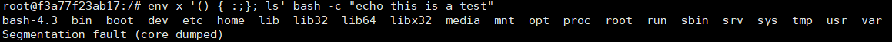
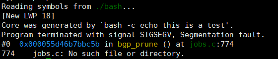
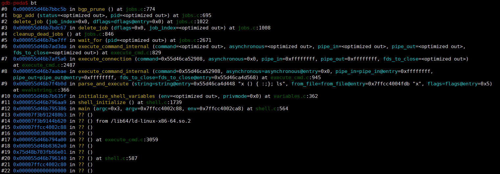
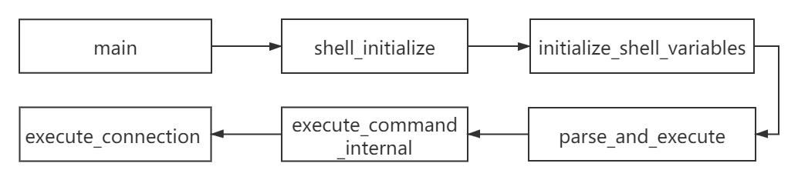

## CVE-2016-6271漏洞分析

### 漏洞介绍

当函数定义被导出到环境变量中将会进行编码，格式为`()函数定义`，接着在开启新Bash进程时，会扫描环境变量中以此形式存在的值并将它们转换回内部函数。Bash在转换的过程中会执行这段函数定义代码，但并不会对其是否只是函数定义进行检查。因此任何能够让Bash在环境中执行指定键值对的人可以通过在函数定义后添加命令来执行任意代码。

### 漏洞分析

触发漏洞令bash产生segmentation fault

```
env x='() { :;}; ls' bash -c "echo this is a test"
```



接着将core dump导出并进行动态调试

```
gdb ./bash core.bash.18.1589963562
```



查看调用栈：



可以看到bash首先在 `shell.c`的`main`函数中调用`shell_initialize`，并通过`variables.c`中的`initialize_shell_variables`函数来对变量进行初始化。在`variables.c`的第329行开始，可以看到在for循环中对所有环境变量进行处理。

在第352行判断传入的变量 (也就是string) 是否符合`STREQN ("() {", string, 4)`，若string的前四个字符串满足`() {`则继续传入到第362行的`parse_and_execute`函数中进行处理。

```
/* Initialize the shell variables from the current environment.
    If PRIVMODE is nonzero, don't import functions from ENV or
    parse $SHELLOPTS. */
void
initialize_shell_variables (env, privmode)
    char **env;
    int privmode;
{
    [...]
     for (string_index = 0; string = env[string_index++]; )
    {
        char_index = 0; 
      	name = string;
      	while ((c = *string++) && c != '=') 
        	;    
      	if (string[-1] == '=') 
        	char_index = string - name - 1; 

      	/* If there are weird things in the environment, like `=xxx' or a
         	string without an `=', just skip them. */
      	if (char_index == 0)
        	continue;

      	/* ASSERT(name[char_index] == '=') */
     	 name[char_index] = '\0';
      	/* Now, name = env variable name, string = env variable value, and
         char_index == strlen (name) */

      	temp_var = (SHELL_VAR *)NULL;

        /* If exported function, define it now.  Don't import functions from
           the environment in privileged mode. */
        if (privmode == 0 && read_but_dont_execute == 0 && STREQN ("() {", string, 4))
        {
            string_length = strlen (string);
          	temp_string = (char *)xmalloc (3 + string_length + char_index);

          	strcpy (temp_string, name);
          	temp_string[char_index] = ' '; 
          	strcpy (temp_string + char_index + 1, string);

          	if (posixly_correct == 0 || legal_identifier (name))
            	parse_and_execute (temp_string, name, SEVAL_NONINT|SEVAL_NOHIST);
            [...]
      }
}
```

接着看`evalstring.c`的`parse_and_execute`函数，通过第一个参数将我们输入的函数定义`x() { :;}; ls`传入其中，可以看到并没有对变量做进一步的判断，而是通过`temp_string`变量直接传入第366行的`execute_command_internal`中。同时传入`SEVAL_NONINT|SEVAL_NOHIST`，从`parse_and_execute`函数开头对flag的定义可知与`temp_string`参数的过滤无关。

```
/* Parse and execute the commands in STRING.  Returns whatever
   execute_command () returns.  This frees STRING.  FLAGS is a
   flags word; look in common.h for the possible values.  Actions
   are:
    (flags & SEVAL_NONINT) -> interactive = 0;
    (flags & SEVAL_INTERACT) -> interactive = 1;
    (flags & SEVAL_NOHIST) -> call bash_history_disable ()
    (flags & SEVAL_NOFREE) -> don't free STRING when finished
    (flags & SEVAL_RESETLINE) -> reset line_number to 1
*/
int
parse_and_execute (string, from_file, flags)
     char *string;
     const char *from_file;
     int flags;
{
	[...]
	/* See if this is a candidate for $( <file ). */
	if (startup_state == 2 &&
                  (subshell_environment & SUBSHELL_COMSUB) &&
                  *bash_input.location.string == '\0' &&
                  command->type == cm_simple && !command->redirects &&
                  (command->flags & CMD_TIME_PIPELINE) == 0 &&
                  command->value.Simple->words == 0 &&
                  command->value.Simple->redirects &&
                  command->value.Simple->redirects->next == 0 &&
                  command->value.Simple->redirects->instruction == r_input_direction &&
                  command->value.Simple->redirects->redirector.dest == 0)
                {
                  int r;
                  r = cat_file (command->value.Simple->redirects);
                  last_result = (r < 0) ? EXECUTION_FAILURE : EXECUTION_SUCCESS;
                }
              else
                last_result = execute_command_internal
                                (command, 0, NO_PIPE, NO_PIPE, bitmap);
              dispose_command (command);
              dispose_fd_bitmap (bitmap);
              discard_unwind_frame ("pe_dispose");
            }
        }
      else
        {
          last_result = EXECUTION_FAILURE;
		}
		[...]
}         

```

进入了`execute_cmd.h`的`parse_and_execute`之后会进一步传递到`execute_connection`, `execute_command_internal`等函数中，最终造成任意命令的执行。

在[补丁](https://gist.github.com/drj11/e85ca2d7503f28ebfde8)中引入了flag`SEVAL_FUNCDEF`以及`SEVAL_ONECMD`值来对输入进行检测。

```
+ #define SEVAL_FUNCDEF 0x080       /* only allow function definitions */
+ #define SEVAL_ONECMD  0x100       /* only allow a single command */
```

并在`parse_and_execute`函数中传入相关flag。

```
-     parse_and_execute (temp_string, name, SEVAL_NONINT|SEVAL_NOHIST);
+     /* Don't import function names that are invalid identifiers from the
+        environment. */
+     if (legal_identifier (name))
+       parse_and_execute (temp_string, name, SEVAL_NONINT|SEVAL_NOHIST|SEVAL_FUNCDEF|SEVAL_ONECMD);
```

总结来说，从输入环境变量到触发命令执行漏洞的跳转流程如下：



