## CVE-2017-0144漏洞分析

### 漏洞介绍

在Windows系统中负责处理SMB的srv.sys程序中，由于SrvOs2FeaListToNt函数在计算FEA LIST的长度时存在错误的类型转换，在特定的情况下攻击者可以构造超过指定长度的输入，从而导致在之后的SrvOs2FeaToNt转换中导致系统非分页内存溢出。

### 漏洞分析

文件扩展特性 (FEA) 是允许用户将计算机中的文件与文件系统未解释的元数据关联的一种文件系统功能。漏洞出现在Windows SMB v1中的内核态函数srv!SrvOs2FeaListToNt在处理FEA(File Extended Attributes)转换时，在大非分页池 (内核的数据结构，Large Non-Paged Kernel Pool) 上存在缓冲区溢出。函数srv!SrvOs2FeaListToNt在将FEA list转换成NTFEA(Windows NT FEA) list前会调用srv!SrvOs2FeaListSizeToNt去计算转换后的FEA lsit的大小。然后会进行如下操作：

1.srv!SrvOs2FeaListSizeToNt会计算FEA list的大小并更新待转换的FEA list的大小。

2.因为错误的使用WORD强制类型转换，导致计算出来的待转换的FEA list的大小比真正的FEA list大。

3.因为原先的总大小计算错误，导致当FEA list被转化为NTFEA list时，会在非分页池导致缓冲区溢出。

首先查看产生溢出的地点，为SrvOs2FeaToNt的第18行，产生越界的地方见上面第二个`memmove`。

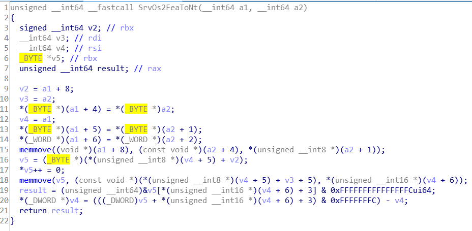

使用WinDbg调试可以查看此处反汇编代码：

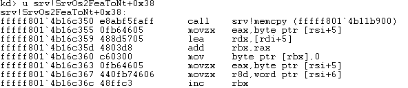

下断点并运行到此处。

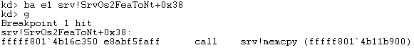

可以看到此时42030.py提示输出如下，已经成功建立了SMB1会话，并且成功创建非分页池。

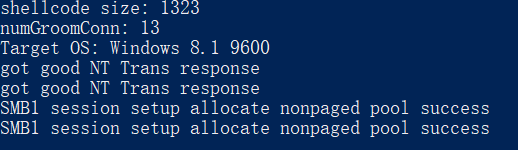

在SrvOs2FeaListToNt中可以看到调用SrvAllocateNonPagedPool的代码段：

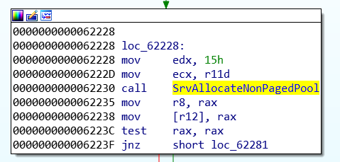

跟进查看可知调用了Windows内核的函数ExAllocatePoolWithTagPriority创建内存池，其中rdx中存放了分配字节数。

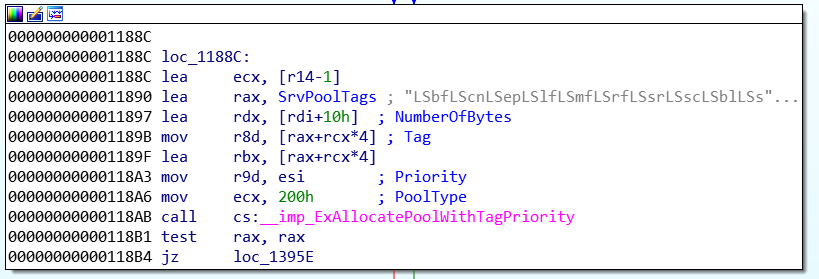

通过将断点下在函数调用处，可以打印每次分配内存池的字节数。

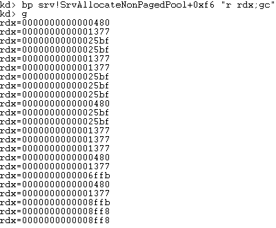

memmove的声明如下，其中str1指向用于存储复制内容的目标数组，str2指向要复制的数据源，n表示复制的字节数。

```
void *memmove(void *str1, const void *str2, size_t n)
```

在第二个memmove处下断点，查看每次复制的源地址，目的地址以及长度。

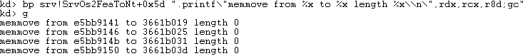

可以看到在最后拷贝的长度发生了变化。

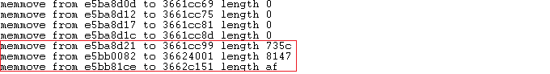

观察最后拷贝时代码执行情况，可知拷贝目的地址0xffffe001863f4151为srvnet.sys给SMB2分配的非分页池。

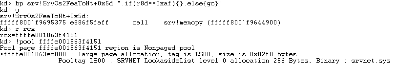

进入memcpy查看，可以看到在地址写入的内容。

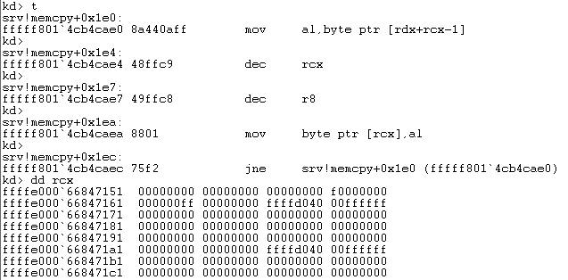

为了明确造成越界拷贝的原因，我们可以查看栈回溯：

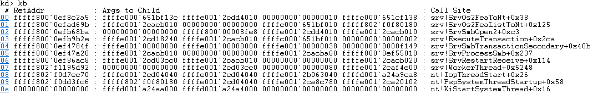

可知漏洞产生的关键点在于*v9 = v12 - (_WORD)v9;这行代码。一旦结束遍历SMBv1消息中的整个FEA元素列表，它就会被执行。该行将用计算所得的长度覆写a1函数参数指向的存储区域中SMB_FEA_LIST块的长度。

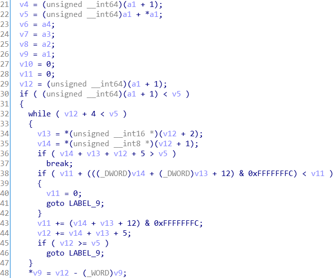

其对应的汇编代码如下：

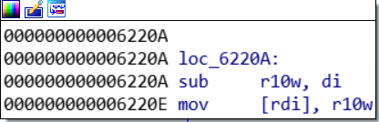

在使用WinDbg调试时，对此处下断点。

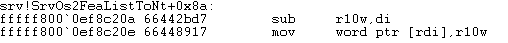

可以看到在执行代码前rdi中的值为00010000。

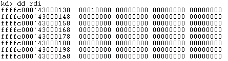

这里`sub r10w, di`本来试图把FEALIST的大小从00010000缩小。然而由于使用了WORD来计算，
结果执行完成之后反而增大了rdi中的值。

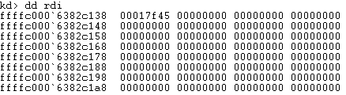

根据42030.py中的代码，可以知道最终shellcode是被写入了0xffffffffffd04000这个地址。

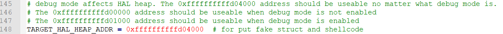

在WinDbg上下断点，当对0xffffffffffd04000这个地址进行写入的时候触发，此时通过观察函数调用栈可以看到是由TCP/IP协议栈拷贝进去的：

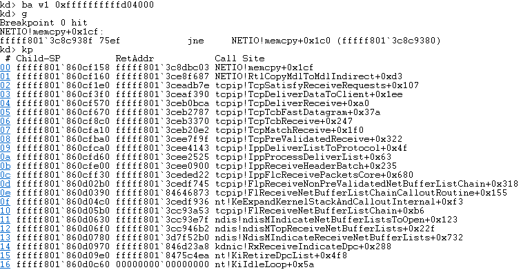

查看该地址处的内容，可知在0x180偏移处写入了shellcode。被写入到0xffffffffffd04000地址的是一个srvnet_recv的结构和紧随其后的shellcode，该结构用于smb结束或断开连接的时候通过SrvNetWskReceiveComplete调用SrvNetCommonReceiveHandler 。SrvNetCommonReceiveHandler 根据srv_recv中的指针此处为指向shellcode的地址0xffffffffffd04180。当结束连接时程序将获取到对应的函数并调用，地址即我们构造的shellcode的地址。

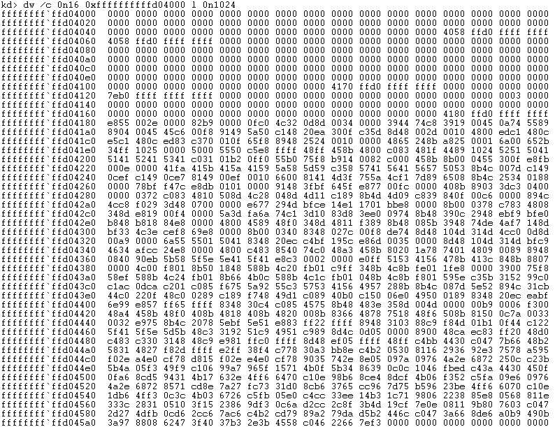

对比shell.bin的内容片段可知一致。

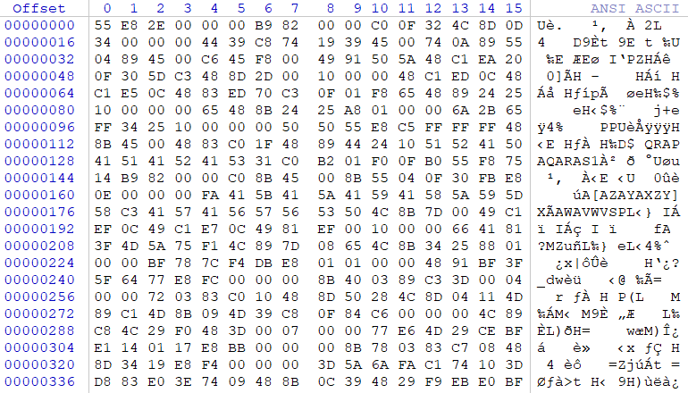

查看此段内存，`--DA--KWEV`中的E表示可执行。

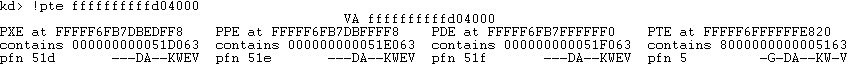

总结EternalBlue攻击的流程如下：

1.通过SMB_COM_NT_TRANSACT发送一段FEA LIST长度满足0x10000的数据包 。

2.发送后续的SMB_COM_TRANSACTION2_SECONDARY，这将导致smb服务将SMB_COM_NT_TRANSACT当做SMB_COM_TRANSACTION2处理，但是最后一个SMB_COM_TRANSACTION2_SECONDARY留置最后。

3.通过smb 2协议进行srvnet对象的spray 。

4.通过SMB_COM_SESSION_SETUP_ANDX漏洞在srvnet对象之后分配一段大小和srv对象大小几乎一致的pool内存 。

5.通过smb 2协议继续进行srvnet对象的spray，以确保srvnet位于srv对象之后 。

6.断开连接导致第4步开辟的pool内存释放，生成一个hole 。

7.发送最后一个SMB_COM_TRANSACTION2_SECONDARY，由于大小一致，该数据包会填补生成 的hole，并触发漏洞导致之后的srvnet对象buffer中的MDL和指针被修改，此时后续发送 的数据将拷贝到ffdff000的位置。 

8.断开所有连接，触发srvnet_recv指向的shellcode执行。