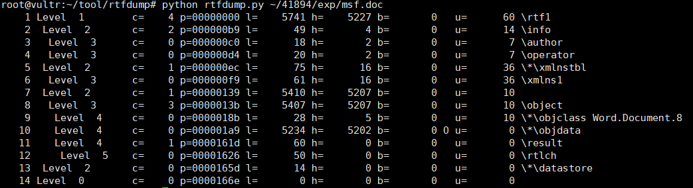

## CVE-2017-0199漏洞分析

### 漏洞介绍

该漏洞利用OFFICE OLE对象链接技术，将包裹的恶意链接对象嵌在文档中，OFFICE调用URL Moniker（COM对象）将恶意链接指向的HTA文件下载到本地， URL Moniker通过识别响应头中content-type的字段信息最后调用mshta.exe执行HTA文件中的VBScript脚本。

### 漏洞分析

OLE（Object Linking and Embedding，对象连接与嵌入），是一种面向对象的技术，利用这种技术可开发可重复使用的软件组件（COM）。OLE可以用来创建复合文档，复合文档包含了创建于不同源应用程序，有着不同类型的数据，因此它可以把文字、声音、图像、表格、应用程序等组合在一起。HTA是HTML Application的缩写（HTML应用程序），可以用vbscript与jscript编写。

通过在Microsoft Word文档创建OLE链接对象，可以实现引用外部资源，再利用Windows的HTA解析逻辑漏洞，可以将从外部获取的HTA文件中的VBScript脚本在本机执行。

使用rtfobj工具对漏洞利用样本msf.doc进行分析，可以看到识别出的OLE对象类名为'OLE2Link'。

使用rtfdump工具获取msf.doc文件中所有对象实体：

由于我们感兴趣的对象在于RTF文件中嵌入的OLE 1.0对象，因此可以通过`-f O`选项来导出OLE对象。可以看到在索引值为10的地方存在OLE的objdata，包含5234个十六进制字符。

通过`-s`参数，我们可以查看在索引值为10处的OLE对象内容，可以看到该对象以`01050000 02000000`作为开头，为表示OLE 1.0对象的CLSID。

使用`-i`参数，可以获取关于此对象更加详细的信息，在这里也能够看到名称为'OLE2Link'：

使用`-E`参数可以将其中嵌入的OLE对象提取出来：

通过`-d`参数，我们可以将对象导出并输入给工具[oledump.py](https://blog.didierstevens.com/programs/oledump-py/)进行分析，可以看到OLE文件包含3个数据流。

使用oledump.py的`-s 1`参数，查看第一个流的内容，可以看到类似URL的字符串：

在受害者打开msf.doc文件，将解析OLE2Link对象并引用上述外部URL所指定的HTA文件，OFFICE将会调用URL Moniker（COM对象）将恶意链接指向的HTA文件下载到本地。使用wireshark抓取攻击者 (IP为涂白部分) 与受害者 (IP为192.168.182.131) 之间的数据包交互可以看到，受害者向攻击者的IP发送HTTP GET请求了'default.hta'文件。

查看请求交互的具体内容，可以看到在攻击者返回的HTTP Header中的Content-Type字段为application/hta。并且其响应体中携带了包含`<script language="VBScript">`字样的脚本，受害者主机中的URL Moniker通过识别响应头中content-type的字段信息，将获取数据作为hta进行解析，并最后调用mshta.exe执行HTA文件中的VBScript脚本，从而达到了任意命令执行。

整个攻击流程如下图所示：

微软提供的COM/OLE技术犹如一把双刃剑，在为开发人员提供方便的同时，也为攻击者进行恶意攻击提供了机会。以此漏洞为例，攻击者巧妙的利用了OLE link object、URL Moniker和Windows在执行HTA文件时会匹配搜索数据流的特性，构造了包含恶意链接的RTF文档，绕过大多数的防御措施，实现自己的恶意行为。