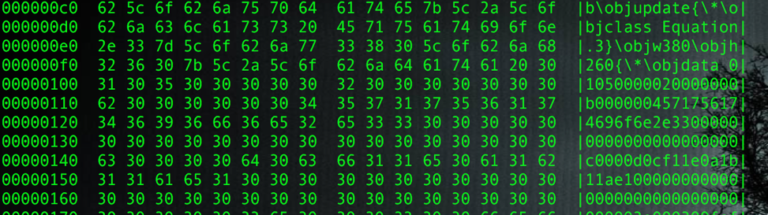
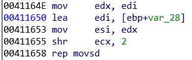
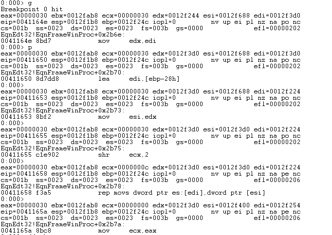
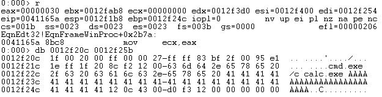
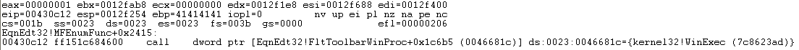
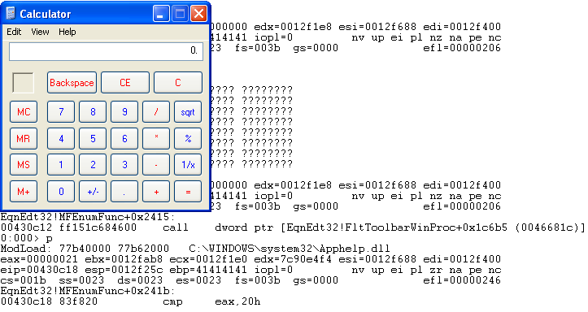

## CVE-2017-11882漏洞分析

### 漏洞介绍

此漏洞是由Office软件里面的公式编辑器造成的，由于编辑器进程没有对名称长度进行校验，导致缓冲区溢出，攻击者通过构造特殊的字符，可以实现任意代码执行。

### 漏洞分析

富文本格式（*Rich Text Format*）即*RTF*格式，又称多文本格式，是由微软公司开发的跨平台文档格式。富文本格式方便于不同的设备、系统查看的文本和图形文档。

Object Linking and Embedding，意为对象连接与嵌入，简称OLE技术。OLE可以用来创建复合文档，复合文档包含了创建于不同源应用程序，有着不同类型的数据，因此它可以把文字、声音、图像、表格、应用程序等组合在一起。

CVE-2017-11882是微软的一个远程执行漏洞，通杀目前市面上的所有office版本及Windows操作系统(包括刚刚停止支持的Office 2007)。该漏洞的成因是EQNEDT32.EXE进程在读入包含MathType的ole数据时，在拷贝公式字体名称时没有对名称长度进行校验，从而造成栈缓冲区溢出。

我们首先分析[GitHub](https://github.com/embedi/CVE-2017-11882/blob/master/example/exploit.rtf)中提供的攻击文件样本exploit.rtf，查看文件二进制内容可以看到其中存在名为Equation.3的对象，表明其是一个OLE equation对象：



通过提取文件中的对象，我们可以看到其中的Equation Native数据流部分：


Equation Native 由几个成员组成：

```
Equation Native = EQNOLEFILEHDR + MTEF Header + MTEF Byte Stream
```

在MTEF Byte Stream 结构中的FONT结构存在漏洞点：

| **Description** | **Size (byte)**           | **Value**                                                   | **Comment**                           |
| --------------- | ------------------------- | ----------------------------------------------------------- | ------------------------------------- |
| Tag             | 1                         | 0x8                                                         | 0x8 denotes Font record               |
| Typeface Number | 1                         | 0x5a                                                        |                                       |
| Style           | 1                         | 0x5a                                                        |                                       |
| Font Name       | Variable, NULL terminated | “cmd.exe /c calc.exe AAAAAAAAAAAAAAAAAAAAAAAA” + 0x00430c12 | Overflow and overwrite return address |

漏洞存在于EQNEDT32.EXE程序的sub_41160F函数中，当程序将超过长度限制的Font Name拷贝到本地创建的缓冲区(0x28字节)中时可造成长度溢出。通过覆盖EBP中的返回地址，可以劫持程序的控制流。



使用WinGbg调试，通过`bp 0x41164e`命令在漏洞触发位置下断点。可知通过`rep movs dword ptr es:[edi],dword ptr [esi]`命令将Font Name拷贝到缓冲区中。



当执行完拷贝后，可以看到ebp此时已经被覆盖，返回地址为0x430c12。



执行到函数返回，之后会跳转到0x430c12，可以看到为WinExec的地址，参数为Font Name，为攻击者可以控制的输入。



单步运行弹出计算器。

