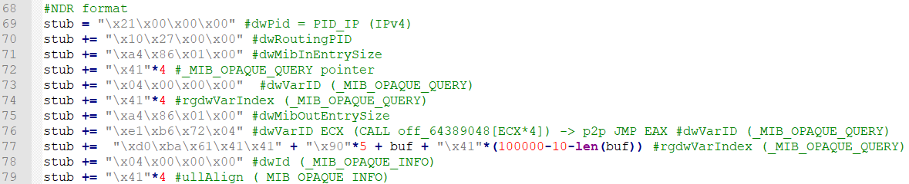
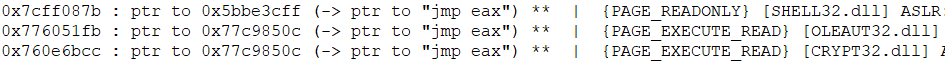

## CVE-2017-11885漏洞分析

### 漏洞介绍

Windows系统中的RRAS服务允许用户对主机的路由、远程访问服务以及站点到站点的连通性进行配置和监控。由于在RRAS协议实现代码的RMIBEntryGetFirst函数中存在根据用户输入执行程序跳转的问题，可导致程序控制流劫持，从而执行任意代码。

### 漏洞分析

首先需要开启RRAS服务，在windows server2003中，通过管理工具->路由和远程访问进行配置。

运行exp并抓包，其中192.168.182.1为攻击者，192.168.182.173为受害者。可以看到，攻击者首先发送了SMB请求，其中包括协商协议、创建会话、身份验证等。并通过Tree Connect AndX Request请求SMB协议调用了`\\192.168.182.173\IPC$`，也就是与受害者主机Windows的IPC通信连接。接着通过NT Create AndX Request请求，攻击者请求访问受害者主机中名为browser的命名管道。

由于在Windows Server 2003中默认存在可匿名访问的命名管道，因此允许未经过授权的远程用户访问这些命名管道。注意到browser是可以匿名访问的匿名管道之一。

上述步骤在exp中对应如下代码。该exp利用到了impacket这个库进行SMB以及DCERPC协议的传输以及远程命名管道的链接。在第35行，绑定了值为`8f09f000-b7ed-11ce-bbd2-00001a181cad`的uuid，代表着唯一的远程服务端程序的标识，对应着RRAS服务的应用程序。

绑定uuid对应的数据包如下：

当成功建立连接并绑定了RRAS服务之后，exp将发送恶意构造的payload。可以看到触发漏洞的函数为RMIBEntryGetFirst，该函数对应的调用号为30。

payload通过Stub data发送。在exp中，首先使用msfvenom生成shellcode存在buf变量中，其功能为让Windows系统产生一个监听在4444端口的tcp shell。

MSRPC采用标准NDR (网络数据表示) 格式的数据进行网络传输，因此stub数据的构造使用NDR格式。具体的各个字段内容可以查阅Microsoft提供的[手册](https://docs.microsoft.com/en-us/openspecs/windows_protocols/ms-rrasm/9102e585-2f62-4408-bfb6-02a6460cc883)。

这里需要关注触发漏洞的点在第76行，由于dwVarID的值对应着CALL off_64389048[ECX*4]中的ECX，通过控制dwVarID的值，我们可以将程序跳转定位到指定地址。在iprtrmgr.dll中可以找到对应存在漏洞的代码位置。

通过下断点调试可以发现EAX寄存器中存放的内容0x02E0C0FC正好为指向我们输入数据的地址，内容为：ECX + "\xd0\xba\x61\x41\x41" + "\x90"*5 + buf + "\x41"\*(100000-10-len(buf))。

因此漏洞利用的思路是通过我们控制的ECX令程序跳转到`jmp eax`指令处，接着程序将自动跳转并执行我们所输入的shellcode。使用Immunity Debugger的mona插件，可以寻找指向存有`jmp eax`片段的指针。其中-type instr表示寻找的数据类型为汇编指令，-s指定寻找的指令内容，-p2p参数指定寻找的为pointer-2-pointer，-x X表示寻找结果所在的数据段需要可执行权限。

寻找到的结果如下：

由`EAX = ( 目的地址 - 偏移 ) / 4`计算出EAX。偏移为0x64439048，通过依次尝试以上三个目的地址，发现0x760e6bcc地址减去偏移可被4整除，计算得到的EAX为0x472b6e1。

最终当shellcode成功被执行，受害者主机将创建一个绑定在4444端口的shell，攻击者尝试连接并获取system权限。

