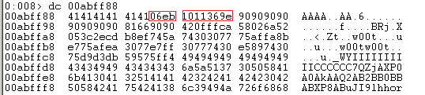
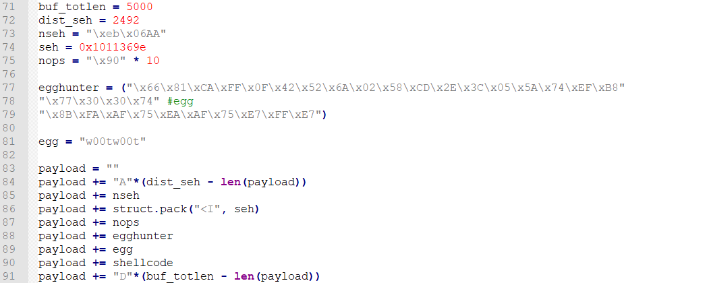

## CVE-2017-15220漏洞分析

### 漏洞介绍

在VX Search Enterprise程序的动态链接库libspp.dll 中安全漏洞，其中负责HTTP操作的函数由于对于输入数据没有进行严格的长度控制，导致在执行获取数据时向无效内存拷贝数据造成缓冲区溢出，触发SEH异常行为处理，通过覆盖SEH指针可控制EIP并执行任意代码。

### 漏洞分析

结构化异常处理（SEH）是一种用于处理硬件和软件异常的窗口机制，它通常表示为尝试/除和的try / catch代码块。在Windows中会维护一个异常处理链表，若程序抛出异常则会在这个链表中搜索相应的处理函数。当程序存在栈溢出漏洞时，可通过覆盖SEH链表指针来劫持控制流，令程序跳转到攻击者所提供的shellcode上。

为了解本exp是如何利用SEH来达成漏洞利用目的的，我们首先在靶机上通过`netstat -ano`命令查看监听端口，由于VX Search Enterprise Server进程会监听在80以及9123端口，因此可知进程对应PID为1352。

使用WinDbg附加进程开始调试，运行exp脚本并在调试命令行输入`g`运行直至触发异常。

可以看到异常发生在0x1009d2ed处的`mov byte ptr [eax],cl`处，为Access violation也就是访问异常。通过`!exchain`命令查看此时的异常链的情况。

查看eax内容如下：

此时查看堆栈内容，可以看到已经被缓冲区溢出覆盖为AAAA。

通过微软提供的插件，可以进一步分析漏洞的情况：

插件分析结果告诉我们异常发生在`libspp!SCA_HttpParser::ParseHttpHeader`函数中。使用IDA打开libspp.dll，找到相应函数。

我们根据漏洞触发点，在IDA定位此处的函数如下：

根据漏洞触发异常位置，我们可以推断该漏洞触发原理就是在缓冲区中循环拷贝直到访问堆栈越界，触发访问异常。下面重新附加程序，并在ParseHttpHeader函数处下断点。

运行exp并输入`g`命令运行至断点处，根据函数名称可以猜测功能为处理来自80端口的HTTP请求。

继续单步运行，可以看到此处对POST请求方式进行验证。

注意到调用了libspp!pcre_exec+0x15792函数之后缓冲区发生了变化，从而定位到缓冲区溢出点。

接下来经过检查返回值，跳转到循环中，重复在堆栈中低地址向高地址中拷贝，覆盖了函数调用的返回值和异常链，最后超出了缓冲区，而此处的缓冲区页表处于程序未定义的地方，所以都是以???????? 呈现出来，触发了访问异常。

直接跑起来得到异常：

查看此时的异常，发现了SEH链已经被覆盖。

查看SEH链在地址0x00abff88处的内容，其中06eb表示汇编代码`eb 06`，意味`JMP 06`：

其中0x1011369e代表我们所覆盖的下一个异常链地址，指向包含`pop, pop, ret`的代码片段。

因此，当程序触发异常后经过SEH链跳转到我们找到的`pop, pop, ret`的代码片段，跳转执行两个pop后esp将向高地址移动两个字节，再执行ret将跳转到esp指向的位置，此时正为异常处理结构对应的地址。因此跳转之后将执行`JMP 06`，跳转到6字节之后执行我们的shellcode。从而完成了漏洞利用链。

从exp的角度看漏洞触发过程：用户向存在漏洞的靶机发送了一个POST请求，其中对应的路径为`/../payload`。

payload的内容如下，为padding+seh+nop+egghunter+egg+shellcode+padding。通过计算覆盖SEH的地址，以及包含`pop,pop,ret`代码段的地址，从而覆盖SEH链表将程序跳转到我们的shellcode之上，最终完成漏洞利用。

