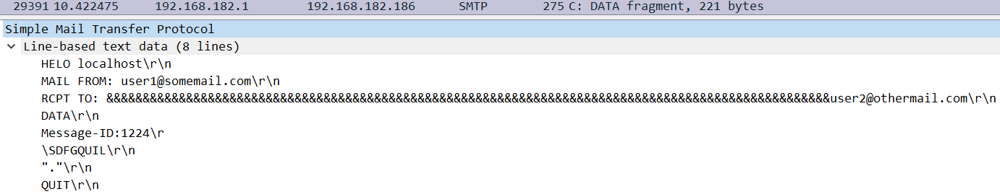

## CVE-2017-15223漏洞分析

### 漏洞介绍

ArGoSoft Mini Mail Server是一款Windows平台下的全功能的邮件服务器，支持POP3/SMTP/FINGER等协议。 ArGoSoft Mini Mail Server 1.0.0.2及之前的版本中存在拒绝服务漏洞。通过向ArGoSoft Mini Mail Server多线程发送不同的RCPT TO对象，可造成电脑cpu和内存资源的占用。

### 漏洞分析

开启ArGoSoft Mini Mail Server服务，通过`netstat -ano`命令可以看到此时PID为3372的程序监听在25端口。

运行exp脚本43026.py，此时看到MiniMail.exe程序占到了98%的CPU。

使用WireShark抓包，可以看到192.168.182.1 (攻击者) 发送了很多SMTP请求给靶机192.168.182.186。使用过滤器`tcp.stream eq 0`跟踪其中的一个数据流，如下图所示：

在编号No.29502的包中，可以看到我们发送的SMTP数据内容，可以看到在RCPT TO字段包含一串很长的由`&`组成的前缀。

查看完整的SMTP客户端-服务器对话内容：

查看43026.py可以看到，变量A的值就对应RCPT TO后面所指定的收件邮箱地址，通过不停循环，将counter的数目每次增加50。string * counter就对应着'&' * counter，因此每次'&'数目将增加50，直到counter>=10000后清零再继续增加。

又由于43026.py采用了多线程，因此攻击者将一直发送包含恶意构造RCPT TO的SMTP请求，造成MiniMail.exe程序的资源一直被占用。
