## CVE-2017-15664漏洞分析

### 漏洞介绍

由Flexense开发的Sync Breeze Enterprise软件指定版本中，通过向9121端口发送的SERVER_GET_INFO包可对程序libpal.dll模块的ECX寄存器值进行控制，导致程序执行特定流程时产生异常崩溃，从而成为DoS漏洞。

### 漏洞分析

运行exp，通过wireshark抓包可以看到攻击者主机与靶机之间的交互过程。首先由192.168.182.1也就是攻击者与存在漏洞的主机192.168.182.186进行TCP三次握手，端口为9121。在第四个编号为No.119的包中，攻击者将精心构造的SERVER_GET_INFO包通过TCP的Data段发送给了靶机。

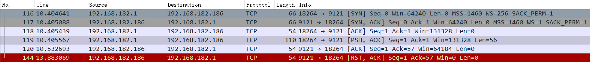

其内容如下，可以看到SERVER_GET_INFO明文内容。

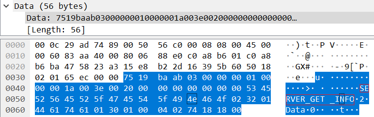

发送payload之后靶机返回一个RST包中断TCP连接。此时查看VX Search Server已经崩溃：

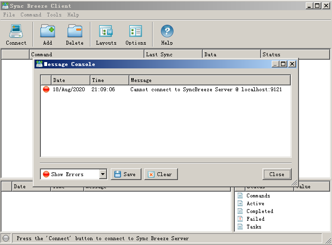

进入Windows的事件查看器，可以看到错误报告中提示错误应用程序为syncbrs.exe，错误模块为libpal.dll。

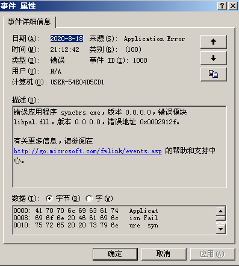

重启程序通过查看程序监听端口的进程可以验证监听在9121端口的进程PID为1336，名称为syncbrs.exe。

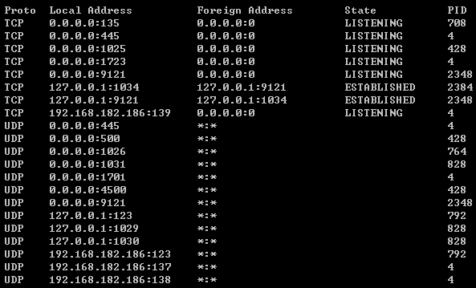

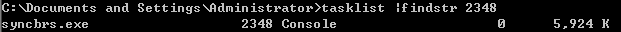

使用Immunity Debugger对进程进行调试。

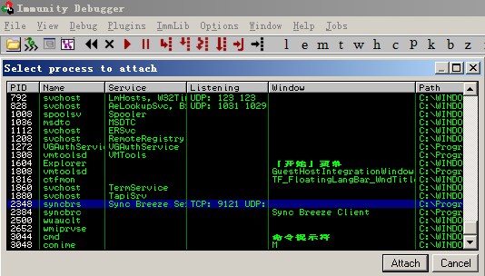

再次运行exp，可以看到程序停止在了0x0049912F的位置，调试器提示错误：`Access violation when reading 0x015B0000`。可知在进行`MOVSX EBP, BTYE PTR DS:[EAX+EBX]`的过程中，EAX+EBX的值超过了内存地址可读范围。

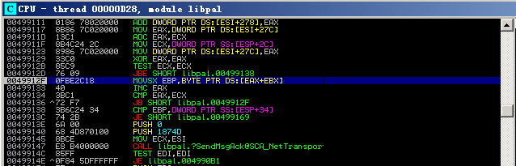

为了进一步了解错误原因，重启syncbrs.exe，在0x0049912F下断点并重新运行exp。运行直至断点，继续单步运行知道在0x0049912F下方会对EAX进行加一并且比较EAX和ECX的值。如果EAX小于ECX，则跳转回0x0049912F并且重新执行上述指令直到EAX和ECX相等。

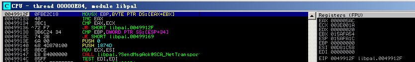

修改payload中注释为evil的字段为"\x00"，并再一次运行exp，令程序运行到断点。

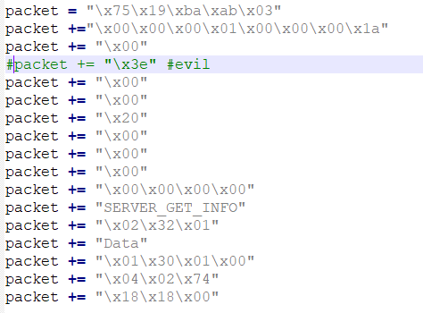

观察右侧的寄存器可以看到ECX的值为0x00000016，和上面的0x003E001A不同。因此猜测我们可以通过payload的值来控制ecx寄存器。

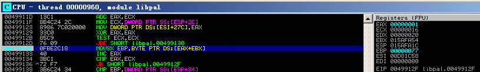

继续运行程序直至结束，并没有产生报错，而是返回了数据。数据内容如下，推测为Control Protocol针对SERVER_GET_INFO请求定制的返回包。

因此漏洞产生的原因可以总结为：由于Sync Breeze Enterprise使用的Control Protocol在处理SERVER_GET_INFO数据包时会将用户输入反应在ECX寄存器中，程序执行特定流程时会因此而触发异常从而导致程序崩溃。因此当攻击者发送恶意构造的数据包时会产生DoS攻击的效果。