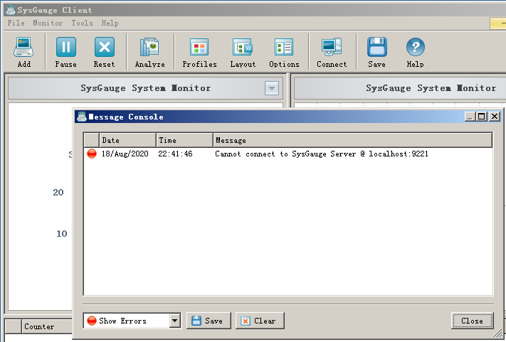
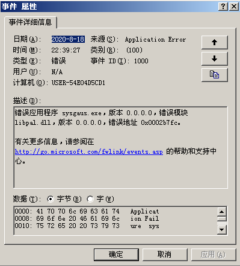
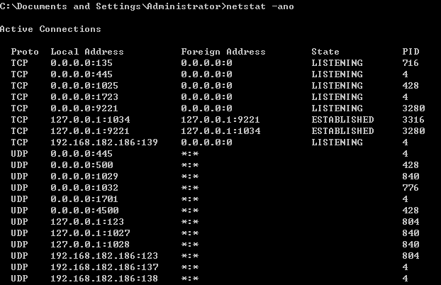
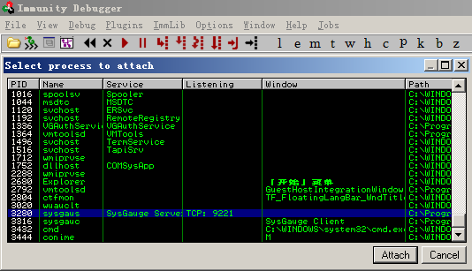
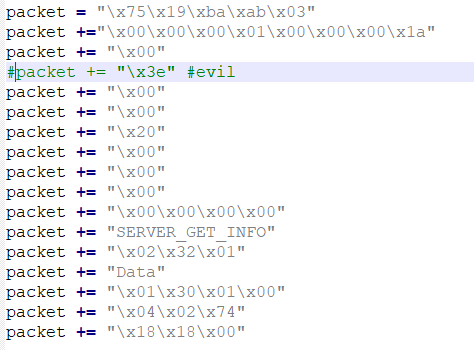

## CVE-2017-15667漏洞分析

### 漏洞介绍

由Flexense开发的SysGauge Server软件指定版本中，通过向9221端口发送的SERVER_GET_INFO包可对程序libpal.dll模块的ECX寄存器值进行控制，导致程序执行特定流程时产生异常崩溃，从而成为DoS漏洞。

### 漏洞分析

运行exp，通过wireshark抓包可以看到攻击者主机与靶机之间的交互过程。首先由192.168.182.1也就是攻击者与存在漏洞的主机192.168.182.186进行TCP三次握手，端口为9221。在第四个编号为No.8的包中，攻击者将精心构造的SERVER_GET_INFO包通过TCP的Data段发送给了靶机。

其内容如下，可以看到SERVER_GET_INFO明文内容。

发送payload之后靶机返回一个RST包中断TCP连接。此时查看SysGauge Server已经崩溃：

进入Windows的事件查看器，可以看到错误报告中提示错误应用程序为sysgaus.exe，错误模块为libpal.dll。

重启程序通过查看程序监听端口的进程可以验证监听在9221端口的进程PID为3280，名称为sysgaus.exe。

使用Immunity Debugger对进程进行调试。

再次运行exp，可以看到程序停止在了0x0045B7FC的位置，调试器提示错误：`Access violation when reading 0x01750000`。可知在进行`MOVSX EBP, BTYE PTR DS:[EAX+EBX]`的过程中，EAX+EBX的值超过了内存地址可读范围。

为了进一步了解错误原因，重启sysgaus.exe，在0x0045B7FC下断点并重新运行exp。运行直至断点，继续单步运行知道在0x0045B7FC下方会对EAX进行加一并且比较EAX和ECX的值。如果EAX小于ECX，则跳转回0x0045B7FC并且重新执行上述指令直到EAX和ECX相等。

修改payload中注释为evil的字段为"\x00"，并再一次运行exp，令程序运行到断点。

观察右侧的寄存器可以看到ECX的值为0x00000059，和上面的0x003E001A不同。因此猜测我们可以通过payload的值来控制ecx寄存器。

继续运行程序直至结束，并没有产生报错，而是返回了数据。数据内容如下，推测为Control Protocol针对SERVER_GET_INFO请求定制的返回包。

因此漏洞产生的原因可以总结为：由于SysGauge Server使用的Control Protocol在处理SERVER_GET_INFO数据包时会将用户输入反映在ECX寄存器中，程序执行特定流程时会因此而触发异常从而导致程序崩溃。因此当攻击者发送恶意构造的数据包时会产生DoS攻击的效果。