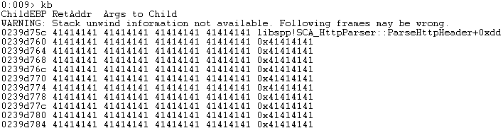

## CVE-2017-6187漏洞分析

### 漏洞介绍

由于Disk Savvy Enterprise Server中的libspp.dll模块在解析HTTP GET请求时存在栈溢出漏洞，攻击者可通过此漏洞覆盖SEH链并执行任意代码。

### 漏洞分析

使用`netstat -ano`命令得知监听在80端口的Disk Pulse Enterprise Server程序PID为2252。

得知对应的进程名称为disksvs.exe。

使用WinDbg附加进程进行调试，运行exp`python .\41436.py target_ip win7`，可以看到出现异常：

查看异常链情况：

可以知道程序报错的原因在于cl向eax指向的地址写入时触发了地址访问异常，查看eax的内容如下：

查看堆栈，可以知道堆栈已经被'AAAA'溢出。

根据上面调试情况可以知道漏洞触发点在libspp.dll中的SCA_HttpParser::ParseHttpHeader函数。使用IDA查看相应代码片段，可知写入eax触发异常的位置在1009718D：

在SCA_HttpParser::ParseHttpHeader函数处下断点，重新运行到此处：

继续单步运行，可以看到调用`libspp!pcre_exec+0x15792 (1014c5b2)`函数后缓冲区发生了变化：

在接下来这一段代码将会验证GET字符串：

将esi和edi进行比较，从而确认接收到的请求为HTTP GET请求。

继续运行，在调用`libspp!pcre_exec+0x15792 (1014c5b2)`函数后，esp缓冲区中的内容发生变化。

接下来经过检查返回值，跳转到循环中，重复在堆栈中低地址向高地址中拷贝，覆盖了函数调用的返回值和异常链，最后超出了缓冲区，触发了访问异常。

继续运行，程序提示产生异常：

查看此时的异常链，可以看到此时已经被修改，其中`06eb`对应`JMP 06`，地址`0x10142e38`中存放着`POP POP RET`的ROP代码段。

查看地址处`0x10142e38`的返汇编代码可以得到验证。

因此程序的利用过程为：通过缓冲区溢出触发异常，覆盖SEH链达到了劫持控制流的目的。