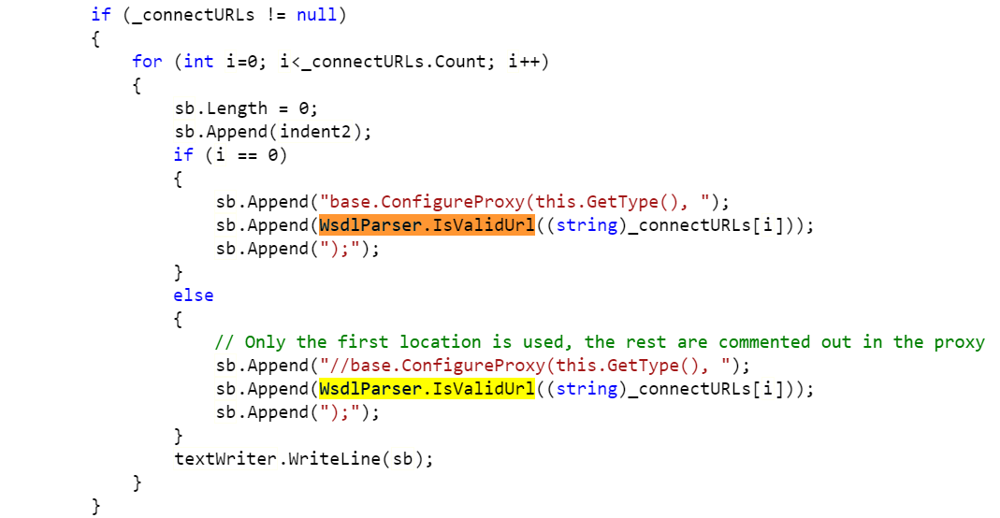
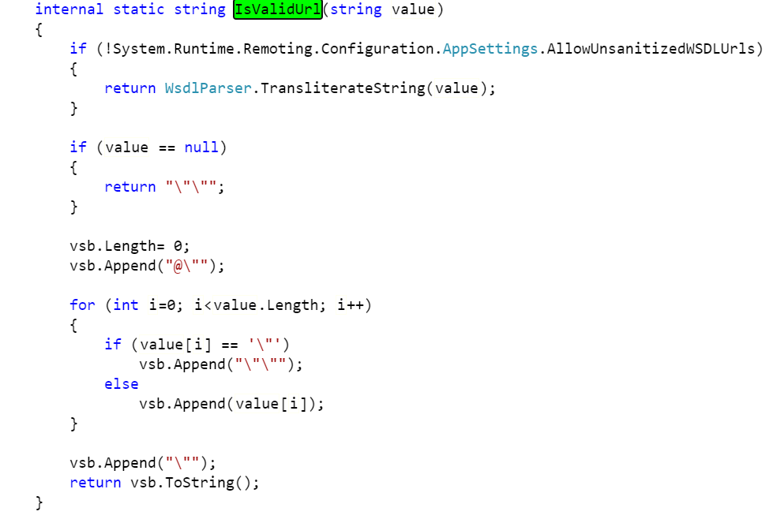
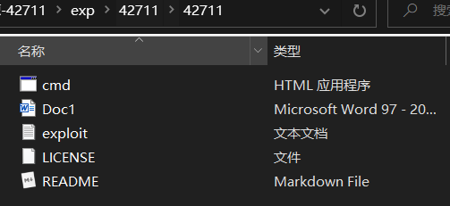
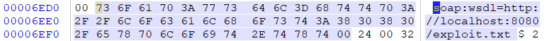
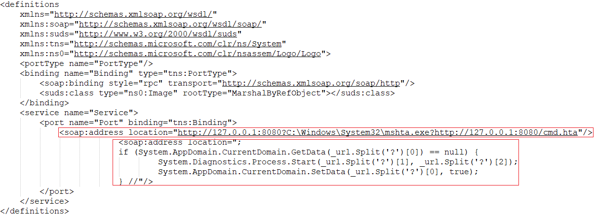
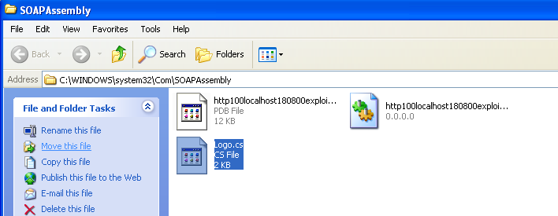
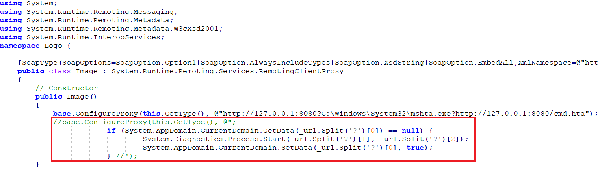
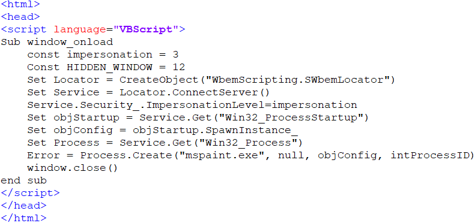

## CVE-2017-8759漏洞分析

### 漏洞介绍

在.Net的PrintClientProxy方法中实现的WSDL解析器代码中存在漏洞，当调用IsValidUrl函数时，由于该函数未能正确处理包含回车换行的输入，导致了任意代码注入。

### 漏洞分析

SOAP（简单对象访问协议，Simple Object Access Protocol)，是交换数据的一种协议规范，使用在计算机网络Web服务中，交换带结构的信息。WSDL（网络服务描述语言，Web Services Description Language）是一门基于 XML 的语言，用于描述 Web Services 以及如何对它们进行访问。WSDL用于描述基于SOAP的Web服务的功能。

在.Net的`PrintClientProxy`方法中实现的[WSDL解析器](http://referencesource.microsoft.com/#System.Runtime.Remoting/metadata/wsdlparser.cs,6111)代码中存在漏洞，当调用[IsValidUrl](http://referencesource.microsoft.com/System.Runtime.Remoting/R/1bd2c5d8fcea7a6b.html)函数时，由于该函数未能正确处理包含回车换行 (CRLF) 的输入，导致了代码注入。下图为`PrintClientProxy`中的一段代码，在for循环中将遍历`_connectURLs`，当有多个`_connectURL`时将第一个URL传入`WsdlParser.IsValidUrl()`函数中，将返回结果附加在`sb`中。而第一个之后的URL将进入else条件中，被注释掉后再传入`WsdlParser.IsValidUrl()`函数，最后附加在`sb`中。

但由于`IsValidUrl`函数未能够对URL中存在的CRLF进行过滤，导致回车换行后的内容也被附加在了vsb中，并作为返回值附加在sb中，并通过`textWriter.WriteLine(sb)`将所有内容写入生成的.cs文件中。

在分析了Microsoft .Net中产生漏洞原因之后，接下来让我们分析exp是如何利用漏洞的。在exp文件夹的42711.zip中存在3个文件，分别是cmd.hta、Doc1.doc、exploit.txt。

漏洞的利用过程首先是诱使受害者在Windows中打开Doc1.doc文档，通过SOAP引用地址http://localhost:8080/exploit.txt所指定的WSDL描述 (注意这里的地址可以是外部服务器IP，本exp为了演示方便在受害者主机上直接创建了web服务) 。

Office将通过Macro请求exploit.txt，并启动SOAP WSDL解析器对该内容进行解析。下图为exploit.txt的内容，可以看到其中有两个`<soap:address location="..."/>`标签，WSDL解析器解析该标签时，由于第二个标签的URL中存在CRLF，导致了命令注入。

在经过WSDL解析器解析后，将生成一个.cs文件作为源码保存在工作目录中，接着.NET框架在的csc.exe将会编译这个.cs文件，并生成名称为`http[url_path].dll`的动态链接库。在`C:\WINDOWS\system32\Com\SOAPAssembly`目录下可以看到该.cs文件。

查看该文件的内容，可以看到注释被成功绕过，一段代码被成功插入其中，当该代码执行时将会执行如下命令：`System.Diagnostics.Process.Start(C:\Windows\System32\mshta.exe,http://127.0.0.1:8080/cmd.hta)`。

mshta.exe是Windows操作系统相关程序，英文全称Microsoft HTML Application，可翻译为微软超文本标记语言应用，用于执行.HTA文件。cmd.hta文件的内容如下，该VBScript执行后将通过`Process.Create()`函数打开mspaint.exe程序，也就是Windows系统下的画图程序。

总结来说，exp通过在Word文档中引用的SOAP WSDL对象触发WSDL解析器的解析漏洞，最终达到注入并执行任意代码的目的。