## CVE-2018-6481漏洞分析

### 漏洞介绍

由于在Flexense Disk Savvy Enterprise 10.4.18版本中的libpal.dll模块存在缓冲区溢出漏洞。远程攻击者可通过向TCP 9124端口发送特制的数据包造成栈溢出。通过覆盖结构化异常处理(SEH)链表从而执行任意代码。

### 漏洞分析

使用WinDbg附加在进程disksvs.exe上，运行exp后在WinDbg的命令行输入g，令程序继续运行可以看到提示异常。异常的原因在于执行`call dword ptr [eax+24h]`时访问了错误的地址0x41414165。

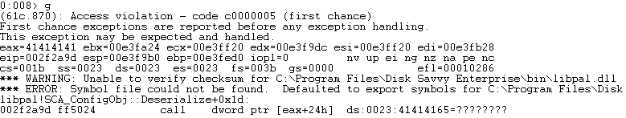

根据之前调试获得的信息，可以确认漏洞触发点在libpal.dll模块的函数`SCA_ConfigObj::Deserialize(char const *,ulong *)`处，在IDA中可以查看相应反汇编代码：

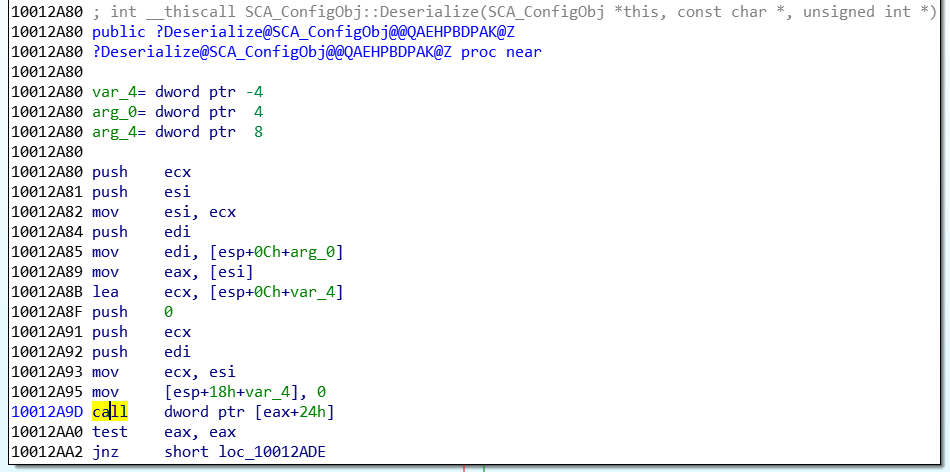

可以看到此时eax的值为41414141，也就是'AAAA'。

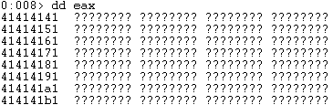

查看栈的调用情况，猜测栈中的内容已经被覆盖。

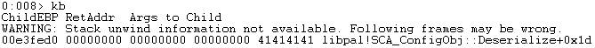

查看此时的异常处理程序链表(SEH)，也已经被覆盖。

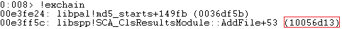

查看栈溢出的情况，可以看到在地址0x00e3faa0处为我们覆盖SEH的内容，其中05eb意为JMP 05，0x10056d13中存放着POP, POP, RET代码片段。

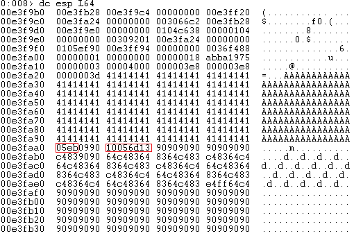

查看0x10056d13地址处的返汇编代码可以验证。

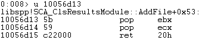

在运行exp的时候使用wireshark抓包，记录下攻击者与靶机之间的数据包交互。使用`tcp.port == 9124`过滤9124端口的数据包如下所示：

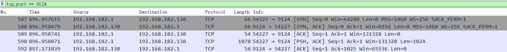

可以看到，首先攻击者使用的主机与靶机之间进行TCP三次握手。接着在第4个(也就是No.590)数据包中，攻击者向靶机发送了一段数据，长度为1024：

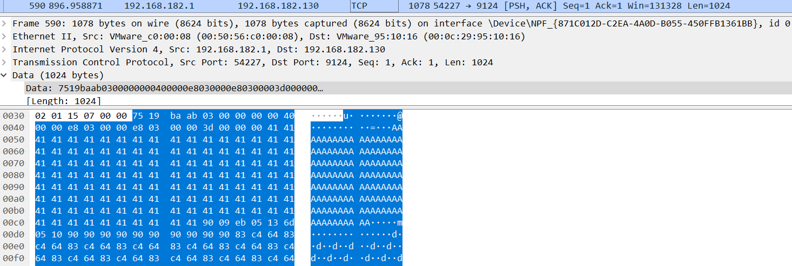

查看exp程序44156.py可知，整个数据包由包头和payload构成：

其中开头的12个字节为Disk Savvy固定的数据包头字段：

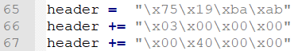

接下来的数据包头字段跟随的是我们所构造的payload的长度。

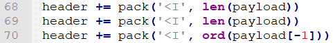

payload则为我们自行构造的漏洞利用部分，首先是由'A'组成的padding，长度为覆盖SEH链表的offset。接着为跳转到shellcode的汇编代码段以及我们需要执行的shellcode。

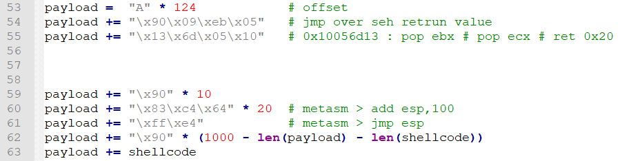

总结来说，程序的利用过程为：通过缓冲区溢出触发异常，覆盖SEH链达到了劫持控制流的目的。