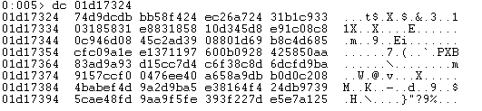

## CVE-2018-9059漏洞分析

### 漏洞介绍

在fsws.exe的sub_4974E0函数中，将UserID通过sprintf，%s与SQL语句拼接复制到栈上（开辟的空间大小为0x100c），只要数据不包含\0并且足够大就会引发缓冲区溢出。

### 漏洞分析

分析exp文件可知shellcode位于HTTP请求所带cookie中的UserID字段，该漏洞很有可能是服务器端在处理UserID时，UserID过长而导致了缓冲区溢出。

将POC中的buf字符串修改为’A’*4200，再次运行exp看是否会导致服务端软件crash。打开Easy File Sharing Web Server7.2并使用windbg附加，再次运行修改过后的exp，发现服务端软件崩溃，达到了我们要的效果。

查看栈回溯：

可以发现触发异常的eax有上级函数传入，并未定义，因此通过IDA定位到4968f4，分析上级函数（通过栈回溯可以观察到返回地址为4968f4，位于fsws.exe）。可以看到：

eax由mov eax, [esp+4+arg_4]指令赋值，可以猜测程序由于上级函数调用时eax已经被恶意构造的shellcode覆盖，通过IDA定位到004975a3，分析上级函数。

可以看到触发漏洞函数调用之前先调用了敏感函数sprintf，因此我们在该函数49758A处下断点，看看漏洞是否是由该函数造成。

我们知道sprintf函数原型为`int sprintf(char *buffer, const char* format, [argument]…)`。其中buffer是char类型的指针，指向写入的字符串指针；format表示格式化字符串，即在程序中想要的格式；argument表示可选参数，可以为任意类型的数据；

查看IDA反编译可知该程序调用sprintf时传入了5个参数：

逐个查看传入参数的内容可知第一个为将要写入的字符串指针24262d0距离栈顶30h。

第二个为格式化字符串select * from %s where %s=’%s’。

第三个参数为sqltable。

第四个参数userid。

第五个参数为我们传入的payload`AAAAAAAAAA`。

很明显当程序将格式化的数据超长长度的字符串A（超过30H），往24262d0写入时导致栈栈溢出。

在看一下该漏洞的利用方式，使用作者提供的exploit.py进行测试，在49758A下断点，在运行call sprint后，栈空间被shellcode覆盖，单步步过并且观察：

当执行到49764d ret 0ch时，返回地址被我们覆盖为恶意构造的7ffa4512。

eip变为7ffa4512，跳转到该地址，可知该位置的指令机器码为ffe4即jmp esp。

而此时esp为414136eb，由于eb364141对应的机器码为jmp eip+36，因此将跳转到eip+36处继续执行。

此时eip+36位置布置的即是执行calc.exe进程的shellcode。

因此最终达到了劫持程序控制流并执行弹出计算器代码的目的。

